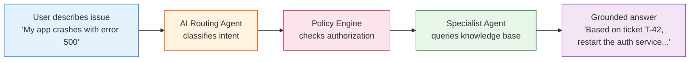
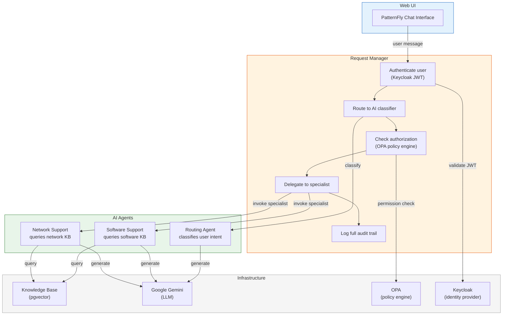

# Partner Agent Integration Framework

AI-powered partner support that routes users to the right expert, every time.

> **Based on** the [IT Self-Service Agent Quickstart](https://github.com/rh-ai-quickstart/it-self-service-agent) by Red Hat AI -- adapted into a standalone POC focused on partner support with Google Gemini, PatternFly UI, and simplified A2A HTTP communication.

## The Problem

Partner support teams waste time triaging and routing issues manually. Users don't know which team to contact. When they guess wrong, the back-and-forth delays resolution. And there's no guarantee the answer they get is grounded in what's actually worked before.

## The Solution

This framework puts an AI routing layer between the user and your specialist teams. A user describes their problem in plain language. The system figures out which specialist can help, checks that the user is authorized to access that team, and returns an answer grounded in your historical support data -- not hallucinated.



## Key Capabilities

### Intelligent Routing

Users don't pick a queue or guess a category. They describe their problem and the AI routes it to the right specialist automatically. Software issues go to the software team. Network issues go to the network team. No manual triage.

### Knowledge-Grounded Responses

Specialist agents query a knowledge base of historical support tickets using RAG (Retrieval-Augmented Generation). Every answer references real past cases and known solutions -- not generic advice the LLM invented.

### Enterprise-Grade Security

A Zero Trust security model ensures users can only access agents they're authorized for. The system uses four layers of defense-in-depth, including policy-engine hard gates that the AI cannot bypass. Credentials are propagated end-to-end and every request is fully audited.

### Simple Agent-to-Agent Communication

Agents communicate over plain HTTP. No message brokers, no event buses, no shared memory. This makes the system easy to understand, deploy, debug, and scale horizontally.

## How It Works



**That is:**

1. A user signs in and types a message like "My app crashes with error 500"
2. The system authenticates them via Keycloak and loads their permissions
3. An AI routing agent reads the message and decides it's a software issue
4. The policy engine confirms the user is authorized to access the software team
5. The software specialist queries the knowledge base for similar past tickets
6. The LLM generates a response that references specific tickets and known fixes
7. Everything is logged -- who asked, what they asked, which agent answered, how long it took

## Quick Start

```bash
git clone https://github.com/rh-ai-quickstart/agentic-partners-integration
cd agentic-partners-integration
export GOOGLE_API_KEY=your-key-here   # or add to .env
make setup                            # builds, starts, and configures everything
```

Open http://localhost:3000 and sign in with one of the test users:

| User | Access | Try |
|------|--------|-----|
| `carlos@example.com` / `carlos123` | Software support only | "My app crashes with error 500" |
| `luis@example.com` / `luis123` | Network support only | "VPN not connecting" |
| `sharon@example.com` / `sharon123` | All agents | Both queries work |
| `josh@example.com` / `josh123` | No agents (restricted) | All requests denied |

Try signing in as Carlos and asking a network question -- the system will deny it because Carlos doesn't have network department access. Then sign in as Sharon and the same question works.

## Architecture

| Component | What it does |
|-----------|-------------|
| **Web UI** | PatternFly 6 chat interface served by nginx |
| **Request Manager** | Orchestrates authentication, authorization, routing, and audit |
| **Agent Service** | Hosts AI agents (routing + specialists) with pluggable LLM backends |
| **RAG API** | Semantic search over support ticket knowledge base (pgvector) |
| **Keycloak** | OIDC identity provider -- user authentication and department roles |
| **OPA** | Policy engine -- enforces permission intersection (User Departments ∩ Agent Capabilities) |
| **PostgreSQL** | User data, session state, audit logs, and vector embeddings |

All services run as containers. One command (`make setup`) builds and starts everything.

## Documentation

| Document | Description |
|----------|-------------|
| [Getting Started](docs/getting-started.md) | Prerequisites, setup, test users, and first steps |
| [Architecture](docs/architecture.md) | System diagram, request flow, design decisions, project structure, database schema |
| [Security (AAA)](docs/aaa-security.md) | SPIFFE workload identity, Keycloak OIDC, OPA authorization, permission intersection, token propagation, audit trail |
| [RAG](docs/rag.md) | Knowledge base ingestion, vector search, response grounding |
| [A2A Communication](docs/a2a-communication.md) | Agent-to-agent HTTP protocol, endpoint contract, credential propagation |
| [Web UI](docs/web-ui.md) | PatternFly chat interface, pages, nginx architecture |
| [Configuration](docs/configuration.md) | Environment variables, LLM backends (Gemini, OpenAI, Ollama) |
| [API Reference](docs/api-reference.md) | Chat, OPA, and A2A endpoint examples with curl |
| [Development](docs/development.md) | Makefile targets, building, testing, Docker Compose |
| [Production Recommendations](docs/production.md) | Scaling guidance for pgvector, PostgreSQL, Keycloak, OPA, LLM, and more |

## Why This Matters

- **Faster resolution** -- Users get routed to the right specialist immediately, with answers grounded in what's worked before.
- **Consistent quality** -- Every response is backed by real data from your knowledge base, not generic LLM output.
- **Secure by design** -- Four layers of authorization enforcement. The AI can't route users to teams they're not authorized for. Every action is audited.
- **Easy to extend** -- Adding a new specialist is a YAML file and a knowledge base. No code changes to the routing or security layers.
- **Production-ready patterns** -- SPIFFE workload identity, OPA policy-as-code, Keycloak OIDC, and full audit logging. The same patterns used in enterprise platforms, ready for your infrastructure.
