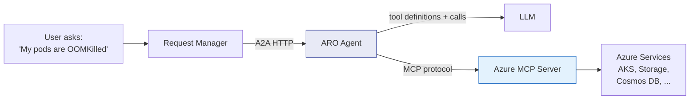
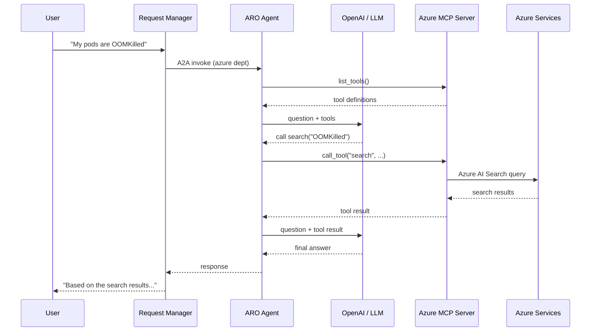
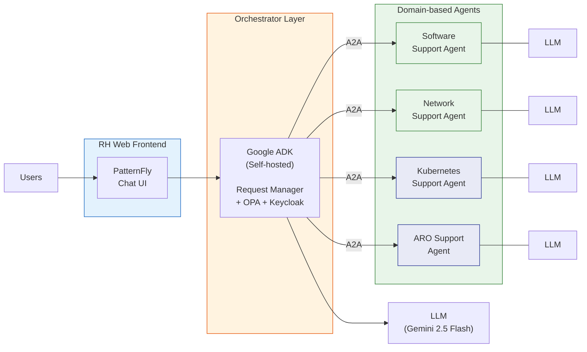

# ARO Support Agent — Azure MCP Server Integration

> **This branch** extends the [Partner Agent Integration Framework](https://github.com/rh-ai-quickstart/agentic-partners-integration) with an ARO Support Agent that uses [Microsoft's Azure MCP Server](https://github.com/microsoft/mcp/tree/main/servers/Azure.Mcp.Server) for live Azure infrastructure troubleshooting via tool calling.
>
> For the core framework (routing, security, RAG, A2A protocol), see the [`main` branch README](https://github.com/rh-ai-quickstart/agentic-partners-integration/tree/main).

## What This Branch Adds

Unlike the in-process Software and Network agents that rely on RAG over a local knowledge base, the ARO agent connects to a live Azure MCP server exposing 40+ tools across Azure services (AKS, Storage, Cosmos DB, Key Vault, Monitor, etc.). The LLM dynamically discovers available tools, decides which to invoke based on the user's question, and executes them via the MCP protocol to inspect real infrastructure state before generating a grounded response.



## How It Works



1. The agent receives a question via A2A invoke
2. It connects to the Azure MCP server and fetches available tool definitions
3. It sends the question + tool definitions to the LLM
4. The LLM decides whether to call tools (search an index, list AKS clusters, etc.)
5. If the LLM requests tool calls, the agent executes them via MCP and feeds results back
6. The loop repeats until the LLM produces a final text answer
7. If no MCP server is configured, the agent answers using LLM knowledge only

## Where It Fits in the Architecture



The ARO agent (shown in blue) runs as a separate container with its own LLM connection. It communicates with the orchestrator solely through the A2A HTTP contract — no shared code, no shared state.

## Key Characteristics

- **Fully independent black box** — uses the OpenAI SDK directly, runs as its own container, and communicates with the orchestrator solely through `POST /api/v1/agents/aro-support/invoke`.
- **MCP tool-calling loop** — fetches tool definitions from the Azure MCP server at runtime, passes them to the LLM, executes any requested tool calls, and feeds results back until the LLM produces a final answer.
- **Configurable tool filter** — limits which of the 110 Azure MCP tools the LLM sees (e.g., only `search`, `storage`, `container`, `cosmos`, `monitor`) to keep context windows manageable.
- **Multiple deployment options** — the Azure MCP server can run via npm locally, as a container, or deployed from the Red Hat AI on OpenShift catalog.
- **Graceful degradation** — if no MCP server is configured, the agent falls back to answering from LLM knowledge alone.

## Quick Start

### Prerequisites

- The core framework running from `main` (see [Getting Started](docs/getting-started.md))
- Python 3.12+
- A Google API key for Gemini (default) — or any OpenAI-compatible API
- **Optional:** Azure MCP server + Azure credentials (for live Azure tool access)

### 1. Start the core framework

```bash
git clone https://github.com/rh-ai-quickstart/agentic-partners-integration
cd agentic-partners-integration
git checkout aro
export GOOGLE_API_KEY=your-key-here   # or add to .env
make setup                            # builds, starts, and configures everything
```

### 2. Run the ARO agent without MCP (basic LLM mode)

```bash
cd aro-partner-agent
uv sync
GOOGLE_API_KEY=AIza... uv run python -m aro_agent.main
```

The agent starts on port 8080 and answers Azure/ARO questions using LLM knowledge only. No Azure credentials needed.

```bash
curl -X POST http://localhost:8080/api/v1/agents/aro-support/invoke \
  -H "Content-Type: application/json" \
  -d '{
    "session_id": "test-1",
    "user_id": "carlos@example.com",
    "message": "My pods on ARO keep getting OOMKilled"
  }'
```

### 3. Run with Azure MCP Server (live Azure tools)

**Option A — npm (local development):**

```bash
az login
npx -y @azure/mcp@latest server start --transport http
# Starts on http://localhost:5008/mcp
```

**Option B — container:**

```bash
docker run -d \
  --name azure-mcp-server \
  --network partner-agent-network \
  -e AZURE_TENANT_ID=<TENANT_ID> \
  -e AZURE_CLIENT_ID=<CLIENT_ID> \
  -e AZURE_CLIENT_SECRET=<CLIENT_SECRET> \
  -e AZURE_SUBSCRIPTION_ID=<SUBSCRIPTION_ID> \
  -e ASPNETCORE_URLS=http://+:8080 \
  -e DOTNET_BUNDLE_EXTRACT_BASE_DIR=/tmp/.net \
  -e HOME=/tmp \
  -e ALLOW_INSECURE_EXTERNAL_BINDING=true \
  -p 5008:8080 \
  quay.io/rhoai-partner-mcp/ubi10-ms-azure-mcp-server:1774539732-dotnet-builder \
  --transport http
```

**Option C — RHAOI catalog on OpenShift/ARO:**

Deploy the Azure MCP server from the Red Hat AI on OpenShift MCP catalog. See [`aro-partner-agent/README.md`](aro-partner-agent/README.md) for full deployment instructions including secret creation.

Then point the ARO agent at the MCP server:

```bash
GOOGLE_API_KEY=AIza... \
MCP_SERVER_URL=http://localhost:5008/mcp \
uv run python -m aro_agent.main
```

## What Changed from `main`

| Area | Change |
|------|--------|
| `aro-partner-agent/` | New self-contained Python agent with MCP client, OpenAI SDK, and full test suite |
| `azure-mcp-server/` | Container build and MCP proxy utilities for the Azure MCP server |
| `docker-compose.yaml` | Added ARO agent and Azure MCP server services |
| `agent-service/config/` | ARO support agent YAML registration |
| `keycloak/realm-partner.json` | Added `azure` department for ARO agent authorization |
| `policies/` | Updated OPA rules for ARO agent delegation |

## Detailed Documentation

For the full ARO agent documentation including Azure credential setup, tool filtering, all deployment options, and testing — see [`aro-partner-agent/README.md`](aro-partner-agent/README.md).

For the core framework documentation (architecture, security, RAG, A2A protocol, configuration) — see the [`main` branch](https://github.com/rh-ai-quickstart/agentic-partners-integration/tree/main).
