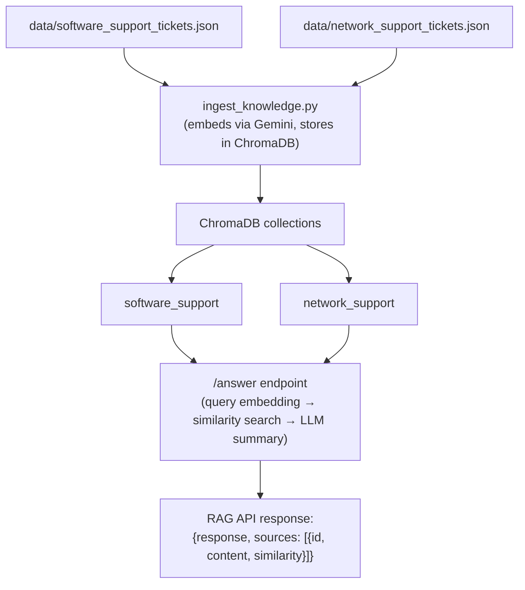
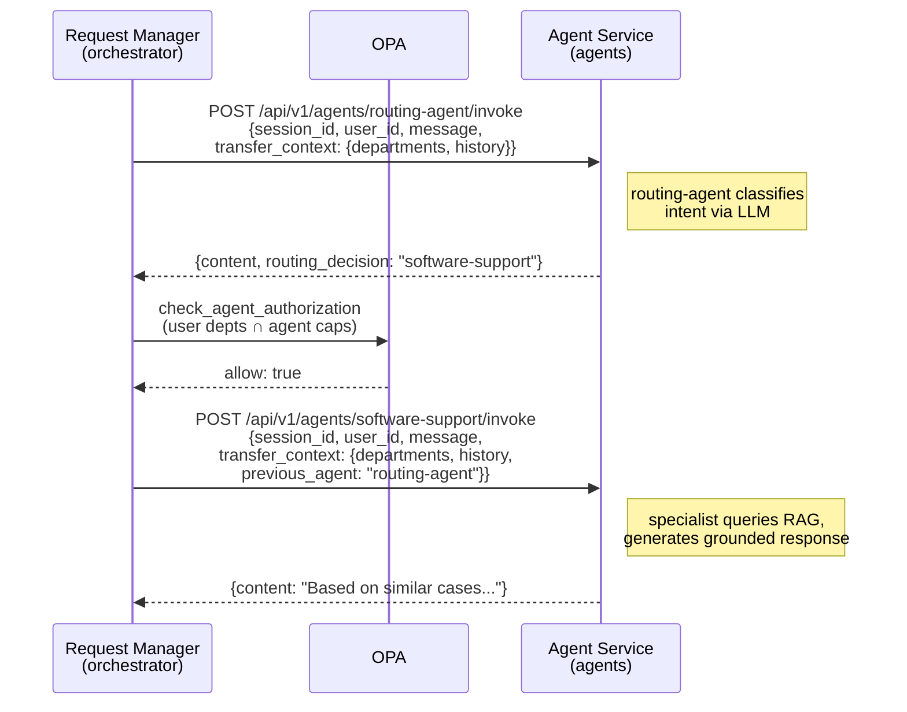
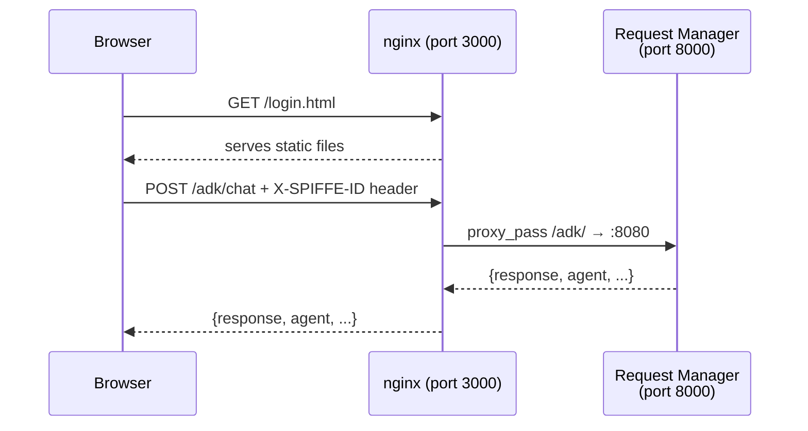
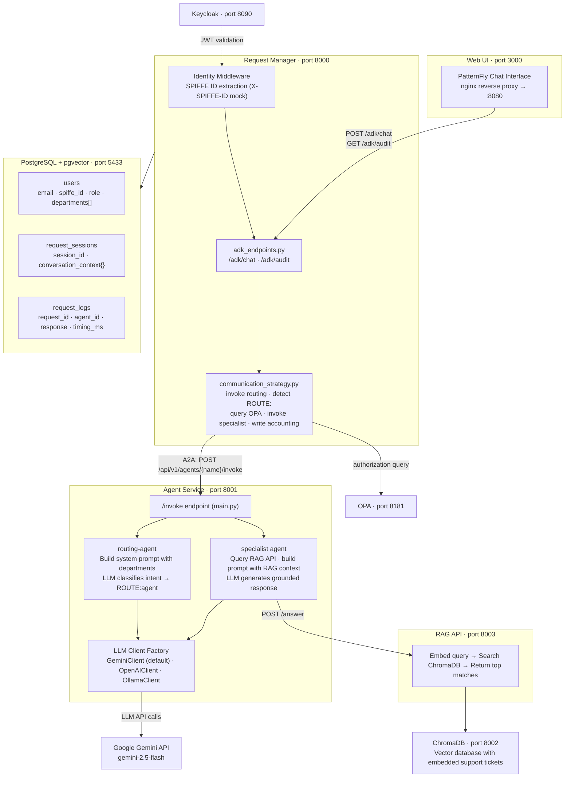

# Partner Agent Integration Framework

> **Based on** the [IT Self-Service Agent Quickstart](https://github.com/rh-ai-quickstart/it-self-service-agent) by Red Hat AI — a production-ready framework for deploying agent-based IT processes on OpenShift with Knative Eventing, evaluations, and multi-channel integrations. This repository adapts that architecture into a standalone POC focused on partner support with Google Gemini, PatternFly UI, and simplified A2A HTTP communication.

**AI-powered support routing system built on four pillars: AAA (Authentication, Authorization, Accounting), RAG-backed specialist agents, A2A (Agent-to-Agent) communication, and a PatternFly chat UI.**

Users sign in, describe their issue, and the system routes them to the right specialist agent (software support or network support) based on their permissions. Agents query a knowledge base of historical support tickets via RAG to provide grounded, context-aware responses. Every request is logged with full accounting.

## TL;DR

```bash
git clone https://github.com/rh-ai-quickstart/agentic-partners-integration
cd agentic-partners-integration
export GOOGLE_API_KEY=your-key-here   # or add to .env
make setup                            # builds, starts, and configures everything
```

Open http://localhost:3000 and log in as `carlos@example.com` / `carlos123`.

## Quick Start

### Prerequisites

- Docker
- Google API Key (for Gemini LLM and embeddings)

### Setup

```bash
git clone <repo-url>
cd agentic-partners-integration
make setup
```

On first run it prompts for your Google API key and saves it to `.env`. Then it builds all container images, starts infrastructure (PostgreSQL, ChromaDB, Keycloak, OPA), runs database migrations, starts application services, ingests the RAG knowledge base, and launches the web UI. At the end it verifies all services are healthy and prints login credentials.

**Services:**

| Service | URL |
|---------|-----|
| Web UI | http://localhost:3000 |
| Request Manager API | http://localhost:8000 |
| Agent Service | http://localhost:8001 |
| RAG API | http://localhost:8003 |
| Keycloak (admin) | http://localhost:8090 |
| OPA | http://localhost:8181 |

### Test Users

| User | Departments | Access |
|------|-------------|--------|
| carlos@example.com | engineering, software | Software support only |
| luis@example.com | engineering, network | Network support only |
| sharon@example.com | engineering, software, network, admin | All agents |
| josh@example.com | _(none)_ | No agents (restricted) |

### Try It

1. Open http://localhost:3000
2. Click **Carlos** (or enter `carlos@example.com` / `carlos123`) and sign in
3. Type: "My app crashes with error 500" -- Routes to software-support agent with RAG context
4. Type: "VPN not connecting" -- Denied (Carlos lacks the `network` department)
5. Log out, sign in as `sharon@example.com` / `sharon123` -- Both queries work (has all departments)

### Run Tests

```bash
make test   # E2E tests covering all four pillars
```

---

## The Four Pillars

### 1. AAA -- Authentication, Authorization, and Accounting

The system implements a Zero Trust AAA framework using **SPIFFE workload identity** for authentication, **OPA (Open Policy Agent)** for authorization, and PostgreSQL-backed accounting for every request.

#### Authentication -- SPIFFE Workload Identity

Instead of passwords and JWT tokens, services authenticate using **SPIFFE IDs** (Secure Production Identity Framework for Everyone). Each service and user is identified by a URI like `spiffe://partner.example.com/user/carlos`.

```
                    Mock Mode (local dev)           Real Mode (production)
                    ─────────────────────           ──────────────────────
Identity source:    X-SPIFFE-ID header              mTLS peer certificate SAN
Transport:          Plain HTTP                      Mutual TLS (mTLS)
Identity type:      Same SPIFFE ID format           Same SPIFFE ID format
Business logic:     Identical                       Identical
```

**How it works:**

1. A single environment variable `MOCK_SPIFFE=true` (default) switches between mock and real mode
2. In **mock mode**, the `X-SPIFFE-ID` header carries identity -- no certificates needed for local dev
3. In **real mode**, SPIFFE IDs are extracted from mTLS peer certificate Subject Alternative Names
4. The `IdentityMiddleware` (FastAPI middleware) extracts identity and sets `request.state.identity`
5. All downstream code uses the same `WorkloadIdentity` dataclass regardless of mode

The mock pattern has only 4 switching points (all in `shared-models/src/shared_models/identity.py`):
- **Inbound identity extraction**: header vs. peer certificate
- **Outbound identity headers**: X-SPIFFE-ID header vs. mTLS client cert
- **Server mode**: plain HTTP vs. TLS
- **Client mode**: plain HTTP vs. mTLS

#### User Authentication -- Keycloak OIDC

User authentication is handled by **Keycloak** (OIDC Identity Provider). A pre-configured Keycloak container starts with `docker compose up`, with the realm `partner-agent`, the 4 test users, and department roles ready to go. Only users configured in Keycloak can log in.

**Auth flow:**

1. UI sends `POST /auth/login` with `{email, password}` to request-manager
2. Request-manager performs a **Resource Owner Password Grant** against Keycloak's token endpoint
3. Keycloak validates credentials and returns a signed JWT (RS256)
4. Request-manager validates the JWT via Keycloak's **JWKS endpoint** and returns `{token, user: {email, role, departments}}`
5. UI stores the JWT and sends it as `Authorization: Bearer` header on subsequent requests

**Auth endpoints** (served by request-manager):

| Endpoint | Method | Description |
|----------|--------|-------------|
| `/auth/login` | POST | `{email, password}` -> `{token, user: {email, role, departments}}` |
| `/auth/me` | GET | Validate Keycloak JWT, return user info |
| `/auth/refresh` | POST | Re-validate JWT |
| `/auth/config` | GET | Return `{keycloak_url, keycloak_realm, client_id}` |

**Pre-configured users** (in `keycloak/realm-partner.json`):

| User | Password | Keycloak Roles (departments) |
|------|----------|------------------------------|
| carlos@example.com | carlos123 | engineering, software |
| luis@example.com | luis123 | engineering, network |
| sharon@example.com | sharon123 | engineering, software, network, admin |
| josh@example.com | josh123 | _(none)_ |

Departments are extracted from Keycloak's `realm_access.roles` claim in the JWT. The Keycloak realm export is at `keycloak/realm-partner.json`.

#### Authorization -- OPA + Permission Intersection

Authorization is enforced by **OPA (Open Policy Agent)** using Rego policies. The core model is **permission intersection**:

```
Effective Access = User Departments ∩ Agent Capabilities
```

When a user delegates access to an agent, the agent can only operate within departments that **both** the user and the agent have access to.

**OPA policies** (in `policies/`):

| File | Purpose |
|------|---------|
| `user_permissions.rego` | Maps users to departments (fallback for local dev) |
| `agent_permissions.rego` | Maps agents to department capabilities |
| `delegation.rego` | Main authorization rules + permission intersection logic |

**Agent capabilities** (from `agent_permissions.rego`):

| Agent | Capabilities |
|-------|-------------|
| routing-agent | software, network, admin |
| software-support | software |
| network-support | network |

**User departments** (from DB or `user_permissions.rego` fallback):

| User | Departments | Can Access |
|------|-------------|------------|
| carlos@example.com | engineering, software | software-support |
| luis@example.com | engineering, network | network-support |
| sharon@example.com | engineering, software, network, admin | all agents |
| josh@example.com | _(none)_ | no agents |

**Example intersection**: Carlos (departments: `[engineering, software]`) + software-support (capabilities: `[software]`) = effective: `[software]` -- access granted. Carlos + network-support (capabilities: `[network]`) = effective: `[]` -- access denied.

**Authorization enforcement** happens at three layers:

| Layer | Where | How |
|-------|-------|-----|
| OPA hard gate | Request Manager | `communication_strategy.py` queries OPA before every specialist A2A call; blocks unauthorized routing regardless of LLM output |
| LLM prompt | Agent Service | Routing-agent's system prompt lists only agents matching the user's departments; LLM won't route to others |
| UI filtering | Chat UI | The UI filters available agents based on user departments |

**OPA policy rules** (from `delegation.rego`):

1. **Service-to-service**: Always allowed (infrastructure calls)
2. **Delegated agent access**: Compute intersection, allow if non-empty
3. **Autonomous agent access**: Always denied (agents require user delegation context)
4. **Unknown agent**: Denied (agent not in capabilities map)

#### Accounting

Every request is logged in the `request_logs` table with a complete audit trail:

```
request_logs table:
  request_id         -- unique request identifier
  session_id         -- conversation session (FK to request_sessions)
  request_type       -- "message"
  request_content    -- the user's message text
  agent_id           -- which agent handled the request (e.g., "software-support")
  response_content   -- the agent's full response text
  response_metadata  -- routing decisions, OPA decision, metadata from the agent
  processing_time_ms -- end-to-end processing time in milliseconds
  completed_at       -- when the response was received
  pod_name           -- which pod/container handled the request
  created_at         -- when the request was received
```

The accounting write-back happens in `communication_strategy.py` after each A2A call completes. The `_complete_request_log()` method updates the `RequestLog` row with the response data, agent identity, and timing.

Session-level accounting is stored in `request_sessions.conversation_context`, which records every message and response in the conversation as a JSON array.

The audit trail is queryable via the **Audit page** (`audit.html`), which calls `GET /adk/audit` and displays a table of all request logs.

---

### 2. RAG -- Retrieval-Augmented Generation

Specialist agents don't hallucinate answers -- they query a knowledge base of historical support tickets via RAG and ground their responses in real data.

#### Data flow



#### How it works

1. **Ingestion** (`ingest_knowledge.py`): Reads JSON support tickets, embeds each ticket using the Gemini embeddings model (`models/gemini-embedding-001`), and stores vectors in ChromaDB collections.

2. **Query** (`rag_service.py`): When a specialist agent receives a user message, the agent-service calls `POST /answer` on the RAG API. The RAG API embeds the query, performs similarity search against ChromaDB, and returns the top matching tickets with similarity scores.

3. **Grounding** (`main.py`): The agent-service builds the LLM prompt by combining the agent's system message, conversation history, and the RAG results as context. The LLM generates a response that references specific ticket IDs and known solutions.

#### Components

| Component | Role | Port |
|-----------|------|------|
| ChromaDB | Vector database storing embedded support tickets | 8002 |
| RAG API | FastAPI service that embeds queries and searches ChromaDB | 8003 |
| Gemini Embeddings | `models/gemini-embedding-001` for vector generation | -- |

#### Synthetic data

The system ships with synthetic support tickets in `data/`:
- **software_support_tickets.json** -- Application crashes, error codes, performance issues
- **network_support_tickets.json** -- VPN, DNS, firewall, connectivity problems

Each ticket has an ID, description, resolution, and category.

---

### 3. A2A -- Agent-to-Agent Communication

All inter-agent communication uses exclusively HTTP-based A2A (Agent-to-Agent) calls. There is no message broker, no event bus, no shared memory -- agents talk directly over HTTP.

#### Communication pattern



#### How it works

1. **`DirectHTTPStrategy`** in `communication_strategy.py` handles all A2A communication.
2. **`EnhancedAgentClient`** (`agent_client_enhanced.py`) sends `POST /api/v1/agents/{agent_name}/invoke` to the agent-service.
3. **`transfer_context`** carries the user's `departments`, `conversation_history`, and `previous_agent` across each A2A call, so the receiving agent has full context.
4. **Two-hop routing:** The request-manager first invokes the routing-agent. If the response contains a `routing_decision`, the request-manager queries OPA for authorization, then makes a second A2A call to the specialist agent.
5. **OPA enforcement at every hop:** The request-manager queries OPA (`check_agent_authorization()`) before each specialist invocation using the permission intersection model. The routing-agent's prompt also restricts which agents it can route to based on `departments`.
6. **Accounting at every hop:** After each A2A call completes, `_complete_request_log()` records the responding agent, full response, and processing time in `request_logs`.

#### A2A endpoint contract

```
POST /api/v1/agents/{agent_name}/invoke

Request:
  session_id: str       — conversation session
  user_id: str          — user email
  message: str          — user message text
  transfer_context: {   -- optional context
    departments: []     -- user's department tags (for OPA authorization)
    conversation_history: []  -- prior messages
    previous_agent: str -- which agent handled the last turn
  }

Response:
  content: str          — agent's text response
  routing_decision: str — (routing-agent only) which specialist to delegate to
  agent_name: str       — which agent produced the response
```

#### Why A2A instead of an event bus

- **Simplicity:** No broker infrastructure to deploy and manage.
- **Synchronous responses:** The user waits for a response -- direct HTTP keeps the architecture straightforward.
- **Observability:** Each A2A call is a simple HTTP request with full accounting. No message delivery guarantees to debug.
- **Horizontal scaling:** Agents are stateless HTTP services. Scale by adding replicas behind a load balancer.

---

### 4. PatternFly Web UI

The system uses a custom PatternFly-based chat UI for the chat interface.

#### Pages

| Page | File | Purpose |
|------|------|---------|
| Login | `login.html` | Email form with quick-login buttons for test users. Sets user identity for chat session. |
| Chat | `chat.html` | PatternFly 6 chat interface. Sends `POST /adk/chat` with user email. Displays agent responses with markdown. |
| Audit | `audit.html` | Request audit log. Calls `GET /adk/audit` and displays all request logs in a table with agent, timing, and response data. |
| Index | `index.html` | Landing page that redirects to login or chat based on auth state. |

#### Architecture



The nginx container serves the static HTML/JS files and reverse-proxies `/adk/` and `/api/` requests to the request-manager. No build step, no Node.js runtime -- just static files served by nginx.

---

## Architecture Overview

### System Diagram



### Services

| Service | Port | Role |
|---------|------|------|
| PostgreSQL (pgvector) | 5433 | User data, sessions, accounting logs |
| ChromaDB | 8002 | Vector database for RAG embeddings |
| RAG API | 8003 | Semantic search over support tickets |
| Agent Service | 8001 | LLM-based routing and specialist agents |
| Request Manager | 8000 | AAA enforcement, A2A orchestration, chat API |
| OPA | 8181 | Policy engine for authorization (Rego policies) |
| Keycloak | 8090 | OIDC identity provider (user authentication) |
| Web UI (nginx) | 3000 | PatternFly chat interface |

> **Note:** Ports above are for `make setup` (uses `scripts/setup.sh`). The `docker-compose.yaml` uses different host port mappings: PostgreSQL on 5432, ChromaDB on 8100, RAG API on 8080. Internal container ports remain the same.

### Request Flow

1. **User sends message** -- Web UI sends `POST /adk/chat` with user email and message text.
2. **Identity extraction** -- `IdentityMiddleware` extracts SPIFFE identity (from `X-SPIFFE-ID` header in mock mode). Request Manager resolves user from PostgreSQL, loads departments.
3. **A2A call: routing-agent** -- Request Manager invokes `POST /api/v1/agents/routing-agent/invoke` via A2A, passing `transfer_context` with `departments` and `conversation_history`.
4. **Routing decision** -- Routing-agent's LLM classifies intent. Returns `ROUTE:software-support` or a conversational response.
5. **OPA authorization** -- If routing to a specialist, Request Manager queries OPA with `Delegation(user_spiffe_id, agent_spiffe_id, user_departments)`. OPA computes `User Departments ∩ Agent Capabilities`. Blocked if intersection is empty.
6. **A2A call: specialist agent** -- Request Manager invokes the specialist via A2A. Specialist queries RAG API, gets matching tickets, builds LLM prompt with RAG context, returns grounded response.
7. **Accounting** -- `_complete_request_log()` updates `request_logs` with `agent_id`, `response_content`, `processing_time_ms`, `completed_at`.
8. **Response** -- Request Manager stores conversation turn in `request_sessions.conversation_context`, returns response to the UI.

### Key Design Decisions

- **Single-turn routing:** The routing-agent classifies intent in one LLM call (no multi-turn state machine). Returns `ROUTE:<agent>` or a conversational response.
- **Mandatory RAG:** Specialist agents always query the RAG API. If RAG is unavailable, the request fails (no silent degradation).
- **OPA + permission intersection:** Authorization uses `User Departments ∩ Agent Capabilities` evaluated by OPA. The LLM can't bypass the OPA hard gate.
- **Full accounting:** Every A2A call records which agent handled the request, the response, and processing time.
- **A2A exclusively:** No message brokers. Agents communicate via synchronous HTTP calls.
- **Pluggable LLM:** Backend configured via `LLM_BACKEND` env var. Supports Gemini (default in setup), OpenAI, and Ollama.

---

## Conversation Context

Each chat session maintains conversation history in `request_sessions.conversation_context.messages`:

```json
{
  "messages": [
    {"role": "user", "content": "My app crashes with error 500"},
    {"role": "assistant", "content": "...", "agent": "software-support"},
    {"role": "user", "content": "It happens when I click submit"},
    {"role": "assistant", "content": "...", "agent": "software-support"}
  ]
}
```

- **Sent to routing-agent:** Last 20 messages (for intent classification with context)
- **Sent to specialist agents:** Last 10 messages (for follow-up handling)
- **Max stored:** 40 messages (oldest trimmed)

---

## Agent Configuration

Agents are defined in `agent-service/config/agents/*.yaml` and loaded by `ResponsesAgentManager` at startup.

| Field | Purpose |
|-------|---------|
| `name` | Agent registration key. Must match the name used in `/invoke` URL. |
| `llm_backend` | Which LLM provider to use (gemini, openai, ollama). |
| `llm_model` | Model name passed to the provider. |
| `system_message` | System prompt prepended to every LLM call. |
| `sampling_params.strategy.type` | Sampling strategy (e.g., `top_p`). |
| `sampling_params.strategy.temperature` | Temperature for LLM calls. |
| `sampling_params.strategy.top_p` | Top-p (nucleus) sampling parameter. |

Example (`software-support-agent.yaml`):

```yaml
name: "software-support"
llm_backend: "gemini"
llm_model: "gemini-2.5-flash"
system_message: |
  You are a software support specialist...
sampling_params:
  strategy:
    type: "top_p"
    temperature: 0.7
    top_p: 0.95
```

Available agents:

| File | Agent Name | Role |
|------|-----------|------|
| `routing-agent.yaml` | `routing-agent` | Classifies user intent and routes to the correct specialist |
| `software-support-agent.yaml` | `software-support` | Resolves software issues using RAG-backed knowledge base |
| `network-support-agent.yaml` | `network-support` | Resolves network issues using RAG-backed knowledge base |

---

## Project Structure

```
├── agent-service/              # AI agent processing service
│   ├── config/agents/          # Agent YAML configs (routing, software, network)
│   └── src/agent_service/
│       ├── main.py             # FastAPI app, /invoke endpoint, routing + RAG logic
│       ├── agents.py           # Agent manager, LLM integration, config loading
│       ├── llm/                # Pluggable LLM clients (Gemini, OpenAI, Ollama)
│       └── schemas.py          # Request/response models for /invoke
│
├── request-manager/            # AAA enforcement, A2A orchestration
│   └── src/request_manager/
│       ├── main.py             # FastAPI app, IdentityMiddleware, session cleanup
│       ├── adk_endpoints.py    # /adk/chat, /adk/audit (chat + audit API)
│       ├── communication_strategy.py  # A2A invocation, OPA hard gate, accounting
│       ├── agent_client_enhanced.py   # HTTP client for A2A calls
│       └── credential_service.py      # Request-scoped credential management
│
├── rag-service/                # RAG API (ChromaDB + Gemini embeddings)
│   ├── rag_service.py          # FastAPI service for /answer endpoint
│   └── ingest_knowledge.py     # Data ingestion script
│
├── pf-chat-ui/                 # PatternFly chat web UI
│   ├── static/
│   │   ├── index.html          # Landing page (redirects to login or chat)
│   │   ├── login.html          # Login page with JWT authentication
│   │   ├── chat.html           # Chat interface with PF6 components
│   │   └── audit.html          # Request audit log viewer
│   └── nginx.conf              # Reverse proxy to request-manager
│
├── shared-models/              # Shared library: DB models, migrations, identity, OPA client
├── keycloak/                   # Keycloak realm config (OIDC, --profile oidc)
├── policies/                   # OPA Rego policies (authorization rules)
│   ├── user_permissions.rego   # User-to-department mappings
│   ├── agent_permissions.rego  # Agent capability mappings
│   ├── delegation.rego         # Permission intersection logic
│   └── delegation_test.rego    # Policy tests
├── data/                       # Synthetic support tickets (JSON)
├── scripts/                    # Setup, build, test, and user management scripts
├── helm/                       # Helm chart for Kubernetes/OpenShift deployment
├── Makefile                    # Build, test, lint, and deploy targets
└── docker-compose.yaml         # Full stack compose file (alternative to make setup)
```

---

## Container Images

| Image | Containerfile | Base Image | Contents |
|-------|--------------|------------|----------|
| `partner-agent-service:latest` | `agent-service/Containerfile` | UBI9 Python 3.12 | Agent service + shared-models |
| `partner-request-manager:latest` | `request-manager/Containerfile` | UBI9 Python 3.12 | Request manager + shared-models |
| `partner-rag-api:latest` | `rag-service/Containerfile` | UBI9 Python 3.12 | RAG API (ChromaDB client + Gemini embeddings) |
| `partner-pf-chat-ui:latest` | `pf-chat-ui/Containerfile` | UBI9 nginx 1.24 | Static PatternFly UI + nginx reverse proxy |

All custom images use Red Hat UBI9 base images. Agent service and request manager use a multi-stage build: `registry.access.redhat.com/ubi9/python-312` (builder) / `ubi9/python-312-minimal` (runtime). RAG API uses `ubi9/python-312`. Chat UI uses `ubi9/nginx-124`.

---

## Database

PostgreSQL 16 with pgvector extension. Schema managed by Alembic (current version: 008).

### Core tables

| Table | Purpose |
|-------|---------|
| `users` | SPIFFE identity, roles, `departments` (OPA authorization) |
| `request_sessions` | Session state, `conversation_context` (JSON message history) |
| `request_logs` | Full accounting: request content, response content, agent_id, processing time, timestamps |
| `alembic_version` | Migration tracking |

### Additional tables

| Table | Purpose |
|-------|---------|
| `user_integration_configs` | Per-user integration configuration (WEB type) |
| `user_integration_mappings` | Maps users to external integration identifiers |

Agent conversation state is managed in-memory per request (stateless A2A calls).

---

## Configuration

### Environment Variables

#### LLM

| Variable | Default | Description |
|----------|---------|-------------|
| `LLM_BACKEND` | `openai` | LLM provider: `gemini`, `openai`, or `ollama`. Setup scripts set `gemini`. |
| `GOOGLE_API_KEY` | -- | Required when using Gemini backend |
| `GEMINI_MODEL` | `gemini-2.5-flash` | Model name for Gemini |
| `OPENAI_API_KEY` | -- | Required when using OpenAI backend |
| `OPENAI_MODEL` | -- | Model name for OpenAI (e.g., `gpt-4`) |
| `OLLAMA_BASE_URL` | -- | Ollama server URL (e.g., `http://localhost:11434`) |
| `OLLAMA_MODEL` | -- | Model name for Ollama |

#### Database

| Variable | Default | Description |
|----------|---------|-------------|
| `DATABASE_URL` | -- | PostgreSQL connection string (`postgresql+asyncpg://...`) |

#### A2A Communication

| Variable | Default | Description |
|----------|---------|-------------|
| `AGENT_SERVICE_URL` | `http://agent-service:8080` | Agent service base URL |
| `RAG_API_ENDPOINT` | `http://rag-api:8080/answer` | RAG API answer endpoint URL |
| `AGENT_TIMEOUT` | `120` | Timeout in seconds for A2A calls |
| `STRUCTURED_CONTEXT_ENABLED` | `true` | Send structured `transfer_context` in A2A calls |

#### Identity & Authorization

| Variable | Default | Description |
|----------|---------|-------------|
| `MOCK_SPIFFE` | `true` | Use mock SPIFFE mode (X-SPIFFE-ID header) instead of real mTLS |
| `SPIFFE_TRUST_DOMAIN` | `partner.example.com` | SPIFFE trust domain for identity URIs |
| `OPA_URL` | `http://localhost:8181` | OPA policy engine URL for authorization queries |
| `KEYCLOAK_URL` | `http://keycloak:8080` | Keycloak server URL for OIDC authentication |
| `KEYCLOAK_REALM` | `partner-agent` | Keycloak realm name |
| `KEYCLOAK_CLIENT_ID` | `partner-agent-ui` | Keycloak OIDC client ID |

#### RAG Service

| Variable | Default | Description |
|----------|---------|-------------|
| `CHROMA_HOST` | `chromadb` | ChromaDB hostname |
| `CHROMA_PORT` | `8000` | ChromaDB port (internal) |
| `EMBEDDING_MODEL` | `models/gemini-embedding-001` | Embedding model for vector generation |
| `LLM_MODEL` | -- | LLM model used by RAG service for answer generation |

#### Operations

| Variable | Default | Description |
|----------|---------|-------------|
| `LOG_LEVEL` | `INFO` | Logging level for services |
| `SESSION_CLEANUP_INTERVAL_HOURS` | `24` | How often to run session cleanup |
| `INACTIVE_SESSION_RETENTION_DAYS` | `30` | Days to retain inactive sessions before cleanup |

### LLM Backends

| Backend | Env Vars | Notes |
|---------|----------|-------|
| Gemini | `GOOGLE_API_KEY`, `GEMINI_MODEL` | Used by default in setup. Uses Google AI API. |
| OpenAI | `OPENAI_API_KEY`, `OPENAI_MODEL` | GPT-4, GPT-3.5, etc. |
| Ollama | `OLLAMA_BASE_URL`, `OLLAMA_MODEL` | Local LLMs. No API key needed. |

---

## API Endpoints

### Chat (`/adk`)

```bash
# Login to get a JWT token
TOKEN=$(curl -s -X POST http://localhost:8000/auth/login \
  -H 'Content-Type: application/json' \
  -d '{"email": "carlos@example.com", "password": "carlos123"}' | jq -r '.token')

# Send a message (requires JWT from /auth/login)
curl -X POST http://localhost:8000/adk/chat \
  -H 'Content-Type: application/json' \
  -H "Authorization: Bearer $TOKEN" \
  -d '{"message": "My app crashes with error 500", "user": {"email": "carlos@example.com"}}'

# View audit log
curl http://localhost:8000/adk/audit \
  -H "Authorization: Bearer $TOKEN"
```

### OPA Policy Query

```bash
# Test OPA authorization directly
curl -X POST http://localhost:8181/v1/data/partner/authorization/decision \
  -H 'Content-Type: application/json' \
  -d '{
    "input": {
      "caller_spiffe_id": "spiffe://partner.example.com/service/request-manager",
      "agent_name": "software-support",
      "delegation": {
        "user_spiffe_id": "spiffe://partner.example.com/user/carlos",
        "agent_spiffe_id": "spiffe://partner.example.com/agent/software-support",
        "user_departments": ["engineering", "software"]
      }
    }
  }'
# Response: {"result":{"allow":true,"effective_departments":["software"],...}}
```

### A2A Agent Invocation (Internal)

```bash
# Direct agent invoke (used by request-manager internally via A2A)
curl -X POST http://localhost:8001/api/v1/agents/routing-agent/invoke \
  -H 'Content-Type: application/json' \
  -d '{"session_id": "s1", "user_id": "u1", "message": "Hello"}'
```

---

## Development

### Makefile Targets

```bash
make help                  # Show all available targets
```

**Setup & Deploy:**

| Command | What it does |
|---------|-------------|
| `make setup` | Full stack: build images, start all containers, run migrations, ingest RAG data, verify health. This is the only command you need. |
| `make build` | Build container images only (no start). Useful for pre-building before `setup`. |
| `make stop` | Stop all running containers (preserves data). |
| `make clean` | Stop and remove all containers, volumes, and network. Run `make setup` again after this. |

**Testing:**

| Command | What it does |
|---------|-------------|
| `make test` | Run E2E tests against running services (requires `make setup` first). |
| `make test-unit` | Run unit tests for all packages (no containers needed). |
| `make test-coverage` | Run unit tests with coverage report. |

**Development:**

| Command | What it does |
|---------|-------------|
| `make install` | Install all package dependencies locally (via uv). |
| `make format` | Run isort and Black formatting. |
| `make lint` | Run flake8, isort check, and mypy. |
| `make logs-request-manager` | Tail request-manager container logs. |
| `make logs-agent-service` | Tail agent-service container logs. |
| `make logs-rag-api` | Tail RAG API container logs. |

### Build Containers

`make setup` builds automatically. To build images without starting:

```bash
make build
```

To build individual images:

```bash
docker build -t partner-agent-service:latest -f agent-service/Containerfile .
docker build -t partner-request-manager:latest -f request-manager/Containerfile .
docker build -t partner-rag-api:latest -f rag-service/Containerfile .
docker build -t partner-pf-chat-ui:latest -f pf-chat-ui/Containerfile .
```

### Typical Workflow

```bash
make setup          # First time: build + start everything (~3-5 min)
make test           # Verify all 24 E2E tests pass
# ... use the UI at http://localhost:3000 ...
make stop           # Done for the day

make setup          # Next time: rebuilds and starts fresh
make clean          # When you want to wipe everything
```

`make setup` is idempotent — it stops existing containers, rebuilds images, and starts fresh every time.

### Alternative: Docker Compose

```bash
docker compose up   # Starts stack with different port mappings
```

| Method | Command | PG Port | Chroma Port | RAG Port |
|--------|---------|---------|-------------|----------|
| Makefile (recommended) | `make setup` | 5433 | 8002 | 8003 |
| Docker Compose | `docker compose up` | 5432 | 8100 | 8080 |

Both expose Web UI on 3000, Request Manager on 8000, and Agent Service on 8001.

---

## Production Recommendations

The stack uses lightweight, easy-to-run components for local development. Below are the recommended production-grade alternatives for each service.

### Vector Database: ChromaDB → pgvector

ChromaDB is single-node only with no built-in authentication, replication, or backup tooling. Since the stack already runs PostgreSQL with the pgvector extension, consolidate vector storage into PostgreSQL to eliminate an entire service.

| | PoC (current) | Production |
|---|---|---|
| **Service** | ChromaDB (separate container) | pgvector (existing PostgreSQL) |
| **Why change** | No auth, no clustering, no backup/restore, limited query performance at 100K+ vectors | ACID transactions, RBAC, backups, replication — all inherited from PostgreSQL. One fewer service to operate |
| **Index type** | Default (brute-force) | HNSW index (`CREATE INDEX ON ... USING hnsw (embedding vector_cosine_ops)`) for sub-10ms queries |
| **Scale ceiling** | ~100K vectors | ~10M vectors with HNSW tuning; beyond that, evaluate Weaviate, Qdrant, or Pinecone |
| **Migration path** | — | Move `ingest_knowledge.py` to write embeddings into a `support_tickets_embeddings` table; update RAG service to query PostgreSQL instead of ChromaDB |

### PostgreSQL: Harden for Production

The current setup uses default credentials, no TLS, and a single instance with no replication.

| | PoC (current) | Production |
|---|---|---|
| **Image** | `pgvector/pgvector:pg16` | CrunchyData PGO operator (Kubernetes) or managed PostgreSQL (RDS, Cloud SQL, Azure Database) |
| **Credentials** | Hardcoded `user`/`pass` | Rotated secrets via Vault, Kubernetes Secrets, or cloud IAM |
| **TLS** | Disabled | Required — enable `sslmode=require` in connection strings |
| **High availability** | Single instance | Patroni-based HA (CrunchyData PGO) or Multi-AZ (cloud managed) |
| **Backups** | None | pgBackRest (CrunchyData) or automated cloud snapshots with point-in-time recovery |
| **Connection pooling** | Direct connections | PgBouncer sidecar or built-in cloud pooling |
| **Monitoring** | None | pg_stat_statements, Prometheus postgres_exporter |

### Keycloak: Production Mode

Keycloak runs in `start-dev` mode with an embedded H2 database that loses state on restart.

| | PoC (current) | Production |
|---|---|---|
| **Mode** | `start-dev` (H2 in-memory, no TLS, debug logging) | `start` (production mode) |
| **Database** | Embedded H2 (volatile) | External PostgreSQL (can share the existing cluster in a separate database) |
| **TLS** | Disabled | TLS termination at ingress or Keycloak's built-in TLS (`KC_HTTPS_*`) |
| **Clustering** | Single instance | 2+ replicas with Infinispan distributed cache |
| **Admin credentials** | `admin`/`admin123` | Strong password via secrets management; disable admin console in production |
| **Realm management** | `--import-realm` from JSON | Keycloak Admin API or Terraform keycloak provider for GitOps |

### OPA: Bundle Server + Decision Logging

OPA runs with locally mounted policy files and no audit trail.

| | PoC (current) | Production |
|---|---|---|
| **Policy delivery** | Volume-mounted `.rego` files | OPA bundle server (S3 bucket, HTTP server, or Styra DAS) for versioned policy distribution |
| **Decision logging** | None | Enable OPA decision logs to a central store (Elasticsearch, CloudWatch) for audit compliance |
| **Deployment** | Shared singleton container | Sidecar per service (eliminates network hop and single point of failure) |
| **Policy testing** | `delegation_test.rego` | CI pipeline with `opa test` and `conftest` for policy-as-code validation |
| **Management** | Manual | Styra DAS (commercial) for policy impact analysis, testing, and rollback |

### LLM Backend: Gateway + Failover

The system calls Google Gemini directly with no retry logic, rate limiting, or provider failover.

| | PoC (current) | Production |
|---|---|---|
| **Provider** | Google Gemini (gemini-2.5-flash) direct API | LiteLLM proxy or cloud-managed endpoint (Vertex AI, AWS Bedrock) |
| **Failover** | None — Gemini outage = system down | LiteLLM provides automatic failover across providers (Gemini → OpenAI → Anthropic) |
| **Rate limiting** | None | LiteLLM or API gateway (Kong, Envoy) with per-user token budgets |
| **Cost tracking** | None | LiteLLM tracks cost per request; or cloud provider billing dashboards |
| **Data residency** | Data sent to Google AI API | Vertex AI (keeps data in GCP project), or self-hosted via vLLM with open-weight models (Llama, Mistral) |
| **Retry/circuit breaker** | None | Add tenacity retries with exponential backoff; circuit breaker for sustained failures |

> **Note:** The existing `LLM_BACKEND` env var already supports Gemini, OpenAI, and Ollama. A LiteLLM proxy unifies these behind a single OpenAI-compatible endpoint with automatic fallback.

### Web UI: TLS + Security Headers

The nginx container serves static files over plain HTTP with no security headers.

| | PoC (current) | Production |
|---|---|---|
| **TLS** | Plain HTTP | TLS termination at ingress controller (Kubernetes) or Caddy (automatic Let's Encrypt) |
| **Security headers** | None | `Content-Security-Policy`, `X-Content-Type-Options`, `X-Frame-Options`, `Strict-Transport-Security` |
| **Compression** | Disabled | Enable gzip/brotli in nginx for static assets |
| **Caching** | No cache headers | `Cache-Control` with content hashing for CSS/JS |
| **Build pipeline** | Raw HTML + inline JS | Consider React + `@patternfly/react-core` for a production UI with proper bundling, minification, and CSP compliance |

### RAG Service: Caching + Reranking

The RAG service has no caching, no reranking, and uses a one-time ingestion script.

| | PoC (current) | Production |
|---|---|---|
| **Response caching** | None — every query re-embeds and re-searches | Redis or in-memory LRU cache for repeated queries |
| **Reranking** | None — raw cosine similarity | Cross-encoder reranker (Cohere Rerank, or a local `cross-encoder/ms-marco-MiniLM-L-6-v2`) to improve retrieval precision |
| **Ingestion** | One-time `ingest_knowledge.py` script | Incremental pipeline: watch for new documents, embed delta, update vectors |
| **Document management** | Static JSON files | Document versioning with metadata (source, timestamp, category) for traceability |
| **Evaluation** | None | Retrieval metrics (MRR, NDCG) and answer quality evaluation (RAGAS, or LLM-as-judge) |

### Summary

| Service | PoC | Production | Priority |
|---------|-----|------------|----------|
| ChromaDB | Standalone container | **Consolidate into pgvector** | High |
| PostgreSQL | Single instance, no TLS | **CrunchyData PGO or managed DB** (TLS, HA, backups) | High |
| Keycloak | `start-dev`, H2, no TLS | **Production mode** (external PG, TLS, clustering) | High |
| OPA | Mounted files, no logging | **Bundle server + decision logs** | Medium |
| LLM (Gemini) | Direct API, no failover | **LiteLLM proxy** (failover, rate limiting, cost tracking) | Medium |
| Web UI (nginx) | Plain HTTP, no headers | **TLS + security headers** (Caddy or hardened nginx) | Medium |
| RAG Service | No cache, no reranking | **Add Redis cache + reranker** | Low |

### Stop / Clean

```bash
make stop          # Stop containers (preserves data, fast restart)
make clean         # Stop + remove containers and network (full reset)
```

### Kubernetes Deployment

See [helm/README.md](helm/README.md) for Helm chart deployment to Kubernetes/OpenShift.

### Scripts Reference

| Script | Purpose |
|--------|---------|
| `scripts/setup.sh` | Full setup: build, start, migrate, ingest, verify. Called by `make setup`. |
| `scripts/build_containers.sh` | Build all four container images. Called by `make build`. |
| `scripts/test.sh` | 24 E2E tests covering auth, authorization, RAG, and workflows. Called by `make test`. |
