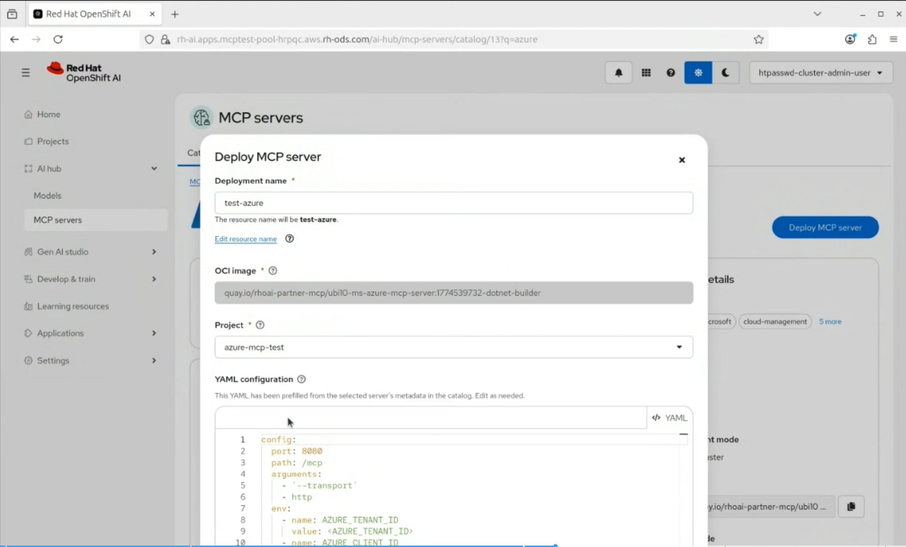

# Deploy AI-Powered Partner Support with Intelligent Routing

[](https://github.com/rh-ai-quickstart/agentic-partners-integration/actions/workflows/ci.yaml)
[](https://github.com/rh-ai-quickstart/agentic-partners-integration/actions/workflows/security-audit.yml)
[](https://github.com/rh-ai-quickstart/agentic-partners-integration/actions/workflows/ci.yaml)
[](https://github.com/rh-ai-quickstart/agentic-partners-integration/actions/workflows/ci.yaml)
[](https://github.com/rh-ai-quickstart/agentic-partners-integration/actions/workflows/ci.yaml)
[](https://github.com/rh-ai-quickstart/agentic-partners-integration/actions/workflows/ci.yaml)

An AI quickstart that routes partner support requests to the right specialist agent, with knowledge-grounded responses and enterprise-grade security.

## Table of Contents

- [Detailed Description](#detailed-description)
  - [See It in Action](#see-it-in-action)
  - [Architecture](#architecture)
- [Requirements](#requirements)
  - [Hardware Requirements](#hardware-requirements)
  - [Software Requirements](#software-requirements)
- [Deploy](#deploy)
  - [Deploy on OpenShift (Helm)](#deploy-on-openshift-helm)
  - [Delete](#delete)
- [Reference](#reference)
- [Key Capabilities](#key-capabilities)
- [Extended Use Cases](#extended-use-cases)
- [Tags](#tags)

## Detailed Description

> **Based on** the [IT Self-Service Agent Quickstart](https://github.com/rh-ai-quickstart/it-self-service-agent) by Red Hat AI — adapted into a standalone POC focused on partner support with a pluggable LLM backend, PatternFly UI, and simplified A2A HTTP communication.

Partner support teams waste time triaging and routing issues manually. Users don't know which team to contact, and when they guess wrong, the back-and-forth delays resolution. There's no guarantee the answer they get is grounded in what's actually worked before.

This AI quickstart puts an intelligent routing layer between the user and your specialist teams. A user describes their problem in plain language. The system figures out which specialist can help, checks that the user is authorized to access that team, and returns an answer grounded in your historical support data — not hallucinated. The solution runs on Red Hat® OpenShift® with a pluggable LLM backend (any OpenAI-compatible endpoint), using PatternFly for the web interface and A2A (Agent-to-Agent) HTTP for inter-agent communication.

The framework demonstrates how to build a multi-agent AI system with real enterprise patterns: SPIFFE workload identity, OPA policy-as-code authorization, Keycloak OIDC authentication, RAG-backed knowledge retrieval, and full audit logging. Every response references real past cases and known solutions — not generic advice the LLM invented.

### See It in Action

> **Demo:** Watch the [Microsoft Build session ODSP915](https://build.microsoft.com/en-US/sessions/ODSP915) for a live walkthrough of this quickstart. Once deployed locally, sign in with one of the test users below and try the following queries:

| User | Access | Try |
|------|--------|-----|
| `carlos@example.com` / `carlos123` | Software + Kubernetes support | "My app crashes with error 500" |
| `luis@example.com` / `luis123` | Network support only | "VPN not connecting" |
| `sharon@example.com` / `sharon123` | All agents | Both queries work |
| `josh@example.com` / `josh123` | No agents (restricted) | All requests denied |

Try signing in as Carlos and asking a network question — the system will deny it because Carlos doesn't have network department access. Try "My pod is in CrashLoopBackOff" — it routes to the Kubernetes agent. Then sign in as Sharon and all queries work.

### Architecture




**How it works:**

1. A user signs in and types a message like "My app crashes with error 500"
2. The system authenticates them via Keycloak and loads their permissions
3. An AI routing agent reads the message and decides it's a software issue
4. The policy engine confirms the user is authorized to access the software team
5. The software specialist queries the knowledge base for similar past tickets
6. The LLM generates a response that references specific tickets and known fixes
7. Everything is logged — who asked, what they asked, which agent answered, how long it took

For detailed architecture diagrams, request flow, and design decisions, see the [Architecture Overview](docs/architecture.md).

## Requirements

### Hardware Requirements

| Resource | Minimum | Recommended |
|----------|---------|-------------|
| CPU | 4 cores | 8 cores |
| RAM | 8 GB | 16 GB (24 GB for larger local models) |
| Disk | 10 GB free | 30 GB free (for local model storage) |
| GPU | Not required | Not required |

This quickstart supports both local open-weight models (via Ollama on CPU) and external LLM APIs. Minimum specs work for small models (Llama 3.2 3B) or external APIs. Recommended specs provide better performance for larger local models (8B+) or faster response times.

### Software Requirements

| Software | Version | Purpose |
|----------|---------|---------|
| [Docker](https://docs.docker.com/get-docker/) | 24.0+ | Container runtime for all services |
| [Git](https://git-scm.com/book/en/v2/Getting-Started-Installing-Git) | 2.30+ | Clone the repository |
| [Make](https://www.gnu.org/software/make/) | 4.0+ | Build automation (included on Linux/Mac) |
| [Ollama](https://ollama.com/) | Latest | **Recommended:** Run local open-weight models (Llama 3.2, Mistral, etc.) |
| **Alternative:** LLM API key | — | Any OpenAI-compatible API (OpenAI, Gemini, Anthropic - see [Configuration](docs/configuration.md)) |

## Deploy

1. **Clone the repository:**

   ```bash
   git clone https://github.com/rh-ai-quickstart/agentic-partners-integration
   cd agentic-partners-integration
   ```

2. **Set up your LLM backend:**

   **Recommended: Local open-weight model with Ollama**

   Run Ollama locally for a fully open-source deployment:

   ```bash
   # Start Ollama
   docker run -d -p 11434:11434 --name ollama ollama/ollama
   
   # Pull an open-weight model (e.g., Llama 3.2)
   docker exec ollama ollama pull llama3.2
   
   # Configure the quickstart
   export AI_PROVIDER=ollama
   export AI_MODEL=llama3.2
   export AI_BASE_URL=http://localhost:11434
   ```

   **Alternative: External API providers**

   If you prefer using external APIs (OpenAI, Gemini, Anthropic):

   ```bash
   export AI_API_KEY=your-key-here
   export AI_PROVIDER=gemini  # or openai, anthropic
   export AI_MODEL=gemini-2.5-flash
   ```

   See [Configuration](docs/configuration.md) for all supported backends, model options, and the full migration guide from legacy environment variables.

3. **Build and start all services:**

   ```bash
   make setup
   ```

   This command builds all container images, starts infrastructure (PostgreSQL with pgvector, Keycloak, OPA), runs database migrations, starts application services, ingests the RAG knowledge base, and launches the web UI. At the end it verifies all services are healthy and prints login credentials.

4. **Open the application:**

   Navigate to [http://localhost:3000](http://localhost:3000) and sign in with one of the [test users](#see-it-in-action).

5. **Verify the deployment:**

   ```bash
   make test
   ```

   This runs unit tests for all services (shared-models, request-manager, agent-service, kubernetes-partner-agent).

### Deploy on OpenShift (Helm)

The same system can be deployed to Red Hat OpenShift using the included Helm chart. All container images are pre-published to `ghcr.io/rh-ai-quickstart` — no local builds required.

**Prerequisites:**

- OpenShift 4.12+ cluster with `oc` CLI authenticated
- Helm 3.8+
- An LLM API key (same as the Docker deployment)

**1. Create a project and install the chart:**

```bash
oc new-project partner-agent

helm install partner-agent ./helm \
  --namespace partner-agent \
  --set llm.googleApiKey='your-google-api-key' \
  --set llm.backend=gemini \
  --set llm.geminiModel=gemini-2.5-flash \
  --set networkPolicies.platform=openshift
```

This deploys all services (PostgreSQL with pgvector, Keycloak, OPA, RAG API, Agent Service, Request Manager, Kubernetes Partner Agent, and the PatternFly Chat UI), runs database migrations, and configures network policies for OpenShift.

**2. Wait for all pods to become ready:**

```bash
oc get pods -n partner-agent -w
```

All pods should show `1/1 Running` within 2-3 minutes. The `db-migration` job will show `Completed`.

**3. Create OpenShift Routes for external access:**

```bash
# Chat UI (main application entry point)
oc create route edge partner-agent-ui \
  --service=partner-agent-pf-chat-ui \
  --port=http \
  --namespace=partner-agent

# Keycloak admin console (optional, for user management)
oc create route edge partner-agent-keycloak \
  --service=partner-agent-keycloak \
  --port=http \
  --namespace=partner-agent
```

**4. Get the route URLs:**

```bash
# Chat UI URL
oc get route partner-agent-ui -n partner-agent \
  -o jsonpath='https://{.spec.host}{"\n"}'

# Keycloak admin URL (optional)
oc get route partner-agent-keycloak -n partner-agent \
  -o jsonpath='https://{.spec.host}{"\n"}'
```

**5. Verify the deployment:**

```bash
# Check all pods are running
oc get pods -n partner-agent

# Check services are reachable internally
oc exec deploy/partner-agent-request-manager -n partner-agent \
  -- curl -sf http://localhost:8080/health

# Check RAG knowledge base was ingested
oc exec deploy/partner-agent-rag-api -n partner-agent \
  -- curl -sf http://localhost:8080/stats

# List all routes
oc get routes -n partner-agent
```

Open the Chat UI route URL in your browser and sign in with any of the [test users](#see-it-in-action). Users are auto-created in the database on first login via Keycloak.

**Alternatively**, if you don't want to create routes, use port-forwarding:

```bash
oc port-forward -n partner-agent svc/partner-agent-pf-chat-ui 3000:3000
# Open http://localhost:3000
```

**Upgrading:**

```bash
helm upgrade partner-agent ./helm \
  --namespace partner-agent \
  --set llm.googleApiKey='your-google-api-key' \
  --set image.tag=v1.2.3
```

**Uninstalling:**

```bash
helm uninstall partner-agent --namespace partner-agent
oc delete project partner-agent
```

For full Helm configuration options (scaling, autoscaling, Ollama, custom values files), see the [Helm chart README](helm/README.md).

### Delete

To stop and remove all Docker containers, volumes, and networks:

```bash
make clean
```

This stops all running containers, removes them, deletes the Docker network and volumes, and cleans up any generated files. Your source code and `.env` file are not affected.

## Reference

| Document | Description |
|----------|-------------|
| [Getting Started](docs/getting-started.md) | Prerequisites, setup, test users, and first steps |
| [Architecture Overview](docs/architecture.md) | System diagram, request flow, design decisions, project structure, database schema |
| [Security (AAA)](docs/aaa-security.md) | SPIFFE workload identity, Keycloak OIDC, OPA authorization, permission intersection, token propagation, audit trail |
| [RAG](docs/rag.md) | Knowledge base ingestion, vector search, response grounding |
| [A2A Communication](docs/a2a-communication.md) | Agent-to-agent HTTP protocol, endpoint contract, credential propagation |
| [Web UI](docs/web-ui.md) | PatternFly chat interface, pages, nginx architecture |
| [Configuration](docs/configuration.md) | Environment variables, LLM backends (OpenAI-compatible, Ollama) |
| [API Reference](docs/api-reference.md) | Chat, OPA, and A2A endpoint examples with curl |
| [Development](docs/development.md) | Makefile targets, building, testing, local Docker |
| [Production Recommendations](docs/production.md) | Scaling guidance for pgvector, PostgreSQL, Keycloak, OPA, LLM, and more |

**External links:**

- [IT Self-Service Agent Quickstart](https://github.com/rh-ai-quickstart/it-self-service-agent) — upstream project this quickstart is based on
- [AI Quickstart Catalog](https://docs.redhat.com/en/learn/ai-quickstarts) — curated collection of AI quickstarts on redhat.com
- [PatternFly 6](https://www.patternfly.org/) — Red Hat design system used for the web UI

## Key Capabilities

### Intelligent Routing

Users don't pick a queue or guess a category. They describe their problem and the AI routes it to the right specialist automatically. Software issues go to the software team. Network issues go to the network team. No manual triage.

### Knowledge-Grounded Responses

Specialist agents query a knowledge base of historical support tickets using RAG (Retrieval-Augmented Generation). Every answer references real past cases and known solutions — not generic advice the LLM invented.

### Enterprise-Grade Security

A Zero Trust security model ensures users can only access agents they're authorized for. The system uses four layers of defense-in-depth, including policy-engine hard gates that the AI cannot bypass. Credentials are propagated end-to-end and every request is fully audited.

### Simple Agent-to-Agent Communication

Agents communicate over plain HTTP using the A2A protocol. No message brokers, no event buses, no shared memory. This makes the system easy to understand, deploy, debug, and scale horizontally.

## Extended Use Cases

New partner agents and integrations are developed in dedicated branches. Each branch adds a self-contained A2A agent that plugs into the orchestrator without modifying the core framework — demonstrating how teams can independently build, test, and iterate on new use cases.

| Branch | Agent | Description |
|--------|-------|-------------|
| [`aro`](https://github.com/rh-ai-quickstart/agentic-partners-integration/tree/aro) | ARO Support Agent | Azure infrastructure troubleshooting via MCP tool calling |

To explore a use case, check out its branch and refer to the agent's own README for setup and usage instructions. Each agent is a fully independent black box — it communicates with the orchestrator solely through the A2A HTTP contract and can be written in any language or framework.

### Deploying MCP Servers on OpenShift AI



For production deployments, MCP servers can be deployed directly through the Red Hat OpenShift AI interface. The MCP servers catalog provides one-click deployment with pre-configured container images, allowing you to deploy Azure MCP servers (or other MCP servers) with automated YAML generation for environment variables, transport configuration, and service endpoints. This is particularly useful for the [`aro`](https://github.com/rh-ai-quickstart/agentic-partners-integration/tree/aro) branch which integrates with the Azure MCP server for live infrastructure troubleshooting.

## Tags

- **Industry:** Telecommunications
- **Partner:** Microsoft
- **Product:** Red Hat OpenShift AI
- **Use case:** Support
- **Status:** production-ready
