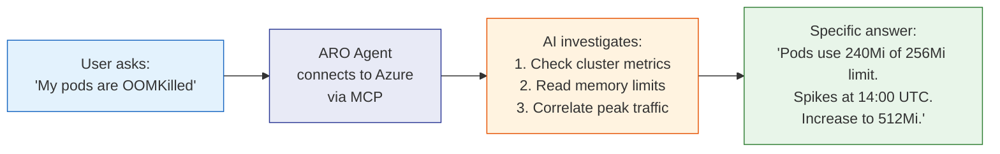
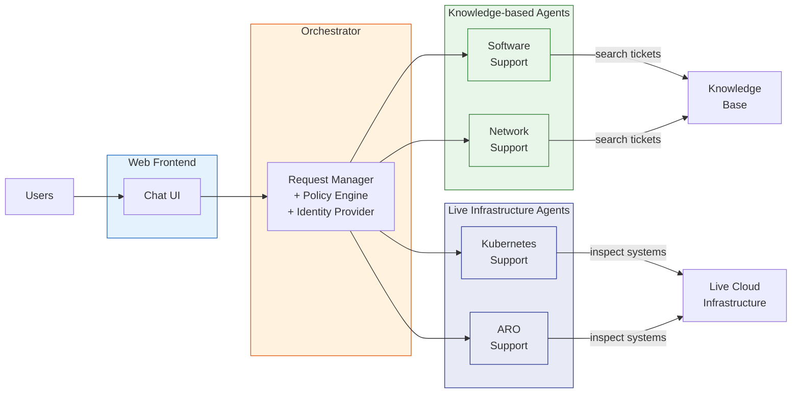

# Deploy ARO Support with Live Azure Troubleshooting

[](https://github.com/rh-ai-quickstart/agentic-partners-integration/actions/workflows/ci.yaml)
[](https://github.com/rh-ai-quickstart/agentic-partners-integration/actions/workflows/security-audit.yml)

An AI quickstart that troubleshoots Azure Red Hat OpenShift issues by connecting to live Azure infrastructure via MCP tool calling.

## Table of Contents

- [Detailed Description](#detailed-description)
  - [See It in Action](#see-it-in-action)
  - [Architecture](#architecture)
- [Requirements](#requirements)
  - [Hardware Requirements](#hardware-requirements)
  - [Software Requirements](#software-requirements)
- [Deploy](#deploy)
  - [Delete](#delete)
- [Reference](#reference)
- [Key Capabilities](#key-capabilities)
- [What Changed from main](#what-changed-from-main)
- [Tags](#tags)

## Detailed Description

> **This branch** extends the [Partner Agent Integration Framework](https://github.com/rh-ai-quickstart/agentic-partners-integration) with an ARO Support Agent that uses [Microsoft's Azure MCP Server](https://github.com/microsoft/mcp/tree/main/servers/Azure.Mcp.Server) for live Azure infrastructure troubleshooting via tool calling.
>
> For the core framework (routing, security, RAG, A2A protocol), see the [`main` branch README](https://github.com/rh-ai-quickstart/agentic-partners-integration/tree/main).

When users report Azure Red Hat® OpenShift® (ARO) infrastructure issues, traditional support agents search a static knowledge base for documented solutions. But infrastructure problems are often unique to the user's environment — a generic runbook can't tell you that *your* pods are using 240Mi of a 256Mi memory limit with traffic spikes at 14:00 UTC.

The ARO Support Agent takes a different approach. Instead of searching tickets, it connects to a live Azure MCP server exposing 40+ tools across Azure services (AKS, Storage, Cosmos DB, Key Vault, Monitor, and more). The LLM dynamically discovers available tools, decides which to invoke based on the user's question, and executes them via the MCP protocol to inspect real infrastructure state before generating a grounded response.

This quickstart demonstrates how to integrate live cloud infrastructure tooling into a multi-agent AI system built on Red Hat® OpenShift®, using MCP as the standard protocol for tool discovery and execution. The same pattern works for any cloud provider or external service that publishes an MCP server — no framework changes required.

### See It in Action

Once deployed, sign in with one of the test users that have Azure department access:

| User | Access | Try |
|------|--------|-----|
| `carlos@example.com` / `carlos123` | Software + Kubernetes + Azure support | "My pods on ARO keep getting OOMKilled" |
| `sharon@example.com` / `sharon123` | All agents | "List my AKS clusters and their node counts" |
| `luis@example.com` / `luis123` | Network support only | Azure queries denied (no `azure` department) |

The ARO agent inspects live Azure resources and returns answers grounded in real data — not hallucinated. The user can verify every claim by checking the same metrics themselves.

### Architecture


```mermaid
flowchart LR
    User["User asks:\n'My pods are OOMKilled'"]
    Agent["ARO Agent\nconnects to Azure\nvia MCP"]
    Investigate["AI investigates:\n1. Check cluster metrics\n2. Read memory limits\n3. Correlate peak traffic"]
    Answer["Specific answer:\n'Pods use 240Mi of 256Mi limit.\nSpikes at 14:00 UTC.\nIncrease to 512Mi.'"]

    User --> Agent --> Investigate --> Answer

    style User fill:#e3f2fd,stroke:#1565c0
    style Agent fill:#e8eaf6,stroke:#283593
    style Investigate fill:#fff3e0,stroke:#e65100
    style Answer fill:#e8f5e9,stroke:#2e7d32
```

**How it works:**

1. The agent receives a question via A2A invoke
2. It connects to the Azure MCP server and fetches available tool definitions
3. It sends the question + tool definitions to the LLM
4. The LLM decides whether to call tools (search an index, list AKS clusters, etc.)
5. If the LLM requests tool calls, the agent executes them via MCP and feeds results back
6. The loop repeats until the LLM produces a final text answer
7. If no MCP server is configured, the agent falls back to answering from LLM knowledge only


```mermaid
flowchart LR
    users["Users"]

    subgraph frontend[" Web Frontend "]
        ui["Chat UI"]
    end

    subgraph orchestrator[" Orchestrator "]
        adk["Request Manager\n+ Policy Engine\n+ Identity Provider"]
    end

    subgraph rag_agents[" Knowledge-based Agents "]
        sw["Software\nSupport"]
        nw["Network\nSupport"]
    end

    subgraph mcp_agents[" Live Infrastructure Agents "]
        k8s["Kubernetes\nSupport"]
        aro["ARO\nSupport"]
    end

    kb["Knowledge\nBase"]
    cloud["Live Cloud\nInfrastructure"]

    users --> ui --> adk
    adk --> sw & nw
    adk --> k8s & aro
    sw & nw -->|search tickets| kb
    k8s & aro -->|inspect systems| cloud

    style frontend fill:#e3f2fd,stroke:#1565c0
    style orchestrator fill:#fff3e0,stroke:#e65100
    style rag_agents fill:#e8f5e9,stroke:#2e7d32
    style mcp_agents fill:#e8eaf6,stroke:#283593
    style sw fill:#e8f5e9,stroke:#2e7d32
    style nw fill:#e8f5e9,stroke:#2e7d32
    style k8s fill:#e8eaf6,stroke:#283593
    style aro fill:#e8eaf6,stroke:#283593
```

The green agents (Software, Network) use **RAG** — they search historical tickets to find documented solutions. The blue agents (Kubernetes, ARO) use **MCP** — they connect to live systems to investigate current state. Different problems need different approaches, but users don't need to know which approach is being used.

For detailed architecture diagrams and the ARO agent's internal structure, see [`aro-partner-agent/README.md`](aro-partner-agent/README.md).

## Requirements

### Hardware Requirements

| Resource | Minimum | Recommended |
|----------|---------|-------------|
| CPU | 4 cores | 8 cores |
| RAM | 8 GB | 16 GB |
| Disk | 10 GB free | 20 GB free |
| GPU | Not required | Not required |

This quickstart uses an external LLM API — no local GPU is needed. All computation runs on CPU via Docker containers.

### Software Requirements

| Software | Version | Purpose |
|----------|---------|---------|
| [Docker](https://docs.docker.com/get-docker/) | 24.0+ | Container runtime for all services |
| [Docker Compose](https://docs.docker.com/compose/install/) | 2.20+ | Multi-container orchestration |
| [Git](https://git-scm.com/book/en/v2/Getting-Started-Installing-Git) | 2.30+ | Clone the repository |
| [Make](https://www.gnu.org/software/make/) | 4.0+ | Build automation (included on Linux/Mac) |
| LLM API key | — | Any OpenAI-compatible API (see [Configuration](docs/configuration.md) for supported backends) |
| **Optional:** [Azure CLI](https://learn.microsoft.com/en-us/cli/azure/install-azure-cli) | 2.60+ | Required only for live Azure MCP tool access |
| **Optional:** Azure MCP server | — | Enables live Azure infrastructure troubleshooting |

## Deploy

### 1. Clone the repository

```bash
git clone https://github.com/rh-ai-quickstart/agentic-partners-integration
cd agentic-partners-integration
git checkout aro
```

### 2. Set your LLM API key

```bash
export GOOGLE_API_KEY=your-key-here
```

The setup script will prompt you if the key is not set. See [Configuration](docs/configuration.md) for alternative LLM backends (OpenAI, Ollama, Azure OpenAI).

### 3. Build and start all services

```bash
make setup
```

This builds all container images (including the ARO agent), starts infrastructure (PostgreSQL with pgvector, Keycloak, OPA), runs database migrations, starts application services, ingests the RAG knowledge base, and launches the web UI. The ARO agent starts in basic LLM mode — it can answer Azure/ARO questions using LLM knowledge without Azure credentials.

### 4. Open the application

Navigate to [http://localhost:3000](http://localhost:3000) and sign in with one of the [test users](#see-it-in-action).

### 5. (Optional) Connect the Azure MCP server for live tools

To enable live Azure infrastructure access, start the Azure MCP server:

**Option A — npm (local development):**

```bash
az login
npx -y @azure/mcp@latest server start --transport http
# Starts on http://localhost:5008/mcp
```

**Option B — container:**

```bash
docker run -d \
  --name azure-mcp-server \
  --network partner-agent-network \
  -e AZURE_TENANT_ID=<TENANT_ID> \
  -e AZURE_CLIENT_ID=<CLIENT_ID> \
  -e AZURE_CLIENT_SECRET=<CLIENT_SECRET> \
  -e AZURE_SUBSCRIPTION_ID=<SUBSCRIPTION_ID> \
  -e ASPNETCORE_URLS=http://+:8080 \
  -e DOTNET_BUNDLE_EXTRACT_BASE_DIR=/tmp/.net \
  -e HOME=/tmp \
  -e ALLOW_INSECURE_EXTERNAL_BINDING=true \
  -p 5008:8080 \
  quay.io/rhoai-partner-mcp/ubi10-ms-azure-mcp-server:1774539732-dotnet-builder \
  --transport http
```

**Option C — Red Hat® AI on OpenShift® catalog:**

Deploy the Azure MCP server from the Red Hat AI on OpenShift MCP catalog. See [`aro-partner-agent/README.md`](aro-partner-agent/README.md) for full deployment instructions including secret creation.

Then restart the ARO agent pointing at the MCP server:

```bash
MCP_SERVER_URL=http://localhost:5008/mcp make setup
```

### 6. Verify the deployment

```bash
make test
```

This runs unit tests for all services (shared-models, request-manager, agent-service, kubernetes-partner-agent, aro-partner-agent, azure-mcp-server).

### Delete

To stop and remove all containers, volumes, and networks:

```bash
make clean
```

This stops all running containers, removes them, deletes the Docker network and volumes, and cleans up any generated files. Your source code and `.env` file are not affected.

## Reference

| Document | Description |
|----------|-------------|
| [ARO Agent Documentation](aro-partner-agent/README.md) | Full ARO agent docs: Azure credentials, tool filtering, MCP transports, API reference, testing |
| [Getting Started](docs/getting-started.md) | Prerequisites, setup, test users, and first steps |
| [Architecture Overview](docs/architecture.md) | System diagram, request flow, design decisions, project structure |
| [Security (AAA)](docs/aaa-security.md) | SPIFFE workload identity, Keycloak OIDC, OPA authorization, audit trail |
| [A2A Communication](docs/a2a-communication.md) | Agent-to-agent HTTP protocol, endpoint contract, credential propagation |
| [Configuration](docs/configuration.md) | Environment variables, LLM backends |
| [Development](docs/development.md) | Makefile targets, building, testing, Docker Compose |

**External links:**

- [Azure MCP Server](https://github.com/microsoft/mcp/tree/main/servers/Azure.Mcp.Server) — Microsoft's MCP server for Azure services
- [Partner Agent Integration Framework (main branch)](https://github.com/rh-ai-quickstart/agentic-partners-integration/tree/main) — core framework documentation
- [AI Quickstart Catalog](https://docs.redhat.com/en/learn/ai-quickstarts) — curated collection of AI quickstarts on redhat.com

## Key Capabilities

### Live Infrastructure Troubleshooting via MCP

Unlike RAG-based agents that search static knowledge bases, the ARO agent connects to live Azure infrastructure through the MCP protocol. The LLM discovers available tools at runtime, decides which to invoke, and executes them to inspect real system state before answering.

### Configurable Tool Filter

The Azure MCP server exposes 110+ tools across 40+ Azure services. A configurable tool filter limits which tools the LLM sees (e.g., only `search`, `storage`, `container`, `cosmos`, `monitor`) to keep context windows manageable and responses focused.

### Multiple MCP Deployment Options

The Azure MCP server can run via npm locally, as a container, or deployed from the Red Hat AI on OpenShift catalog. Each option supports the same MCP protocol — the agent doesn't need to know how the server is deployed.

### Graceful Degradation

If no MCP server is configured, the agent falls back to answering from LLM knowledge alone. This lets you deploy and demo the agent immediately, then add live Azure access when credentials are available.

### Ecosystem Extensibility

The MCP integration is not Azure-specific. The same pattern works for any external service that publishes an MCP server. Each new MCP server from any vendor instantly becomes a potential new agent capability — with no framework changes required.

## What Changed from main

| Area | Change |
|------|--------|
| `aro-partner-agent/` | New self-contained Python agent with MCP client, OpenAI SDK, and full test suite |
| `azure-mcp-server/` | Container build and MCP proxy utilities for the Azure MCP server |
| `docker-compose.yaml` | Added ARO agent and Azure MCP server services |
| `agent-service/config/` | ARO support agent YAML registration |
| `keycloak/realm-partner.json` | Added `azure` department for ARO agent authorization |
| `policies/` | Updated OPA rules for ARO agent delegation |

## Tags

| Tag | Value |
|-----|-------|
| **Industry** | Media and IT services |
| **Partner** | Microsoft |
| **Product** | Red Hat® OpenShift® AI |
| **Use case** | Productivity |
| **Status** | `work-in-progress` |
