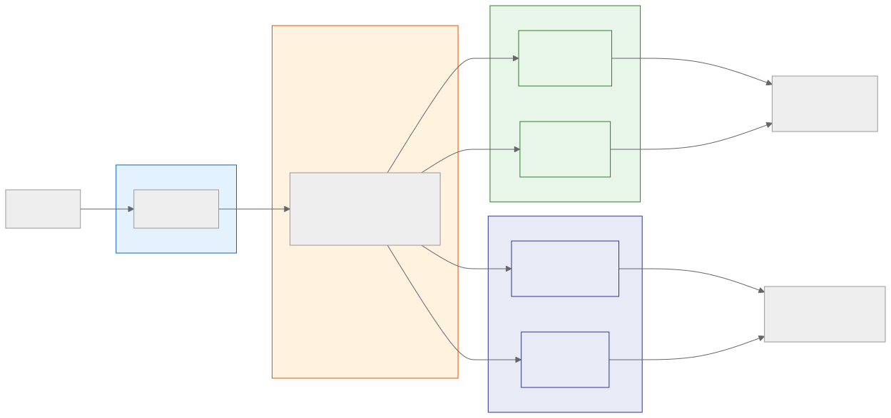

# Deploy ARO Support with Live Azure Troubleshooting

[](https://github.com/rh-ai-quickstart/agentic-partners-integration/actions/workflows/ci.yaml)
[](https://github.com/rh-ai-quickstart/agentic-partners-integration/actions/workflows/security-audit.yml)
[](https://github.com/rh-ai-quickstart/agentic-partners-integration/actions/workflows/ci.yaml)
[](https://github.com/rh-ai-quickstart/agentic-partners-integration/actions/workflows/ci.yaml)
[](https://github.com/rh-ai-quickstart/agentic-partners-integration/actions/workflows/ci.yaml)
[](https://github.com/rh-ai-quickstart/agentic-partners-integration/actions/workflows/ci.yaml)

An AI quickstart that troubleshoots Azure Red Hat® OpenShift® issues by connecting to live Azure infrastructure via MCP tool calling.

## Table of Contents

- [Detailed Description](#detailed-description)
  - [See It in Action](#see-it-in-action)
  - [Architecture](#architecture)
- [Requirements](#requirements)
  - [Hardware Requirements](#hardware-requirements)
  - [Software Requirements](#software-requirements)
- [Deploy](#deploy)
  - [Delete](#delete)
- [Reference](#reference)
- [Key Capabilities](#key-capabilities)
- [What Changed from main](#what-changed-from-main)
- [Tags](#tags)

## Detailed Description

> **This branch** extends the [Partner Agent Integration Framework](https://github.com/rh-ai-quickstart/agentic-partners-integration) with an ARO Support Agent that uses [Microsoft's Azure MCP Server](https://github.com/microsoft/mcp/tree/main/servers/Azure.Mcp.Server) for live Azure infrastructure troubleshooting via tool calling.
>
> For the core framework (routing, security, RAG, A2A protocol), see the [`main` branch README](https://github.com/rh-ai-quickstart/agentic-partners-integration/tree/main).

When users report Azure Red Hat OpenShift (ARO) infrastructure issues, traditional support agents search a static knowledge base for documented solutions. But infrastructure problems are often unique to the user's environment — a generic runbook can't tell you that *your* pods are using 240Mi of a 256Mi memory limit with traffic spikes at 14:00 UTC.

The ARO Support Agent takes a different approach. Instead of searching tickets, it connects to a live Azure MCP server exposing 40+ tools across Azure services (AKS, Storage, Cosmos DB, Key Vault, Monitor, and more). The LLM dynamically discovers available tools, decides which to invoke based on the user's question, and executes them via the MCP protocol to inspect real infrastructure state before generating a grounded response.

This quickstart demonstrates how to integrate live cloud infrastructure tooling into a multi-agent AI system built on Red Hat OpenShift, using MCP as the standard protocol for tool discovery and execution. The same pattern works for any cloud provider or external service that publishes an MCP server — no framework changes required.

### See It in Action

**[▶️ Watch the 45-minute demo video](https://build.microsoft.com/en-US/sessions/ODSP915)** from Microsoft Build 2025 to see the ARO Support Agent troubleshooting live Azure infrastructure, or deploy locally and try it yourself with the test users below.

Once deployed, sign in with one of the test users that have Azure department access:

| User | Access | Try |
|------|--------|-----|
| `carlos@example.com` / `carlos123` | Software + Kubernetes + Azure support | "My pods on ARO keep getting OOMKilled" |
| `sharon@example.com` / `sharon123` | All agents | "List my AKS clusters and their node counts" |
| `luis@example.com` / `luis123` | Network support only | Azure queries denied (no `azure` department) |

The ARO agent inspects live Azure resources and returns answers grounded in real data — not hallucinated. The user can verify every claim by checking the same metrics themselves.

### Architecture


**How it works:**

1. The agent receives a question via A2A invoke
2. It connects to the Azure MCP server and fetches available tool definitions
3. It sends the question + tool definitions to the LLM
4. The LLM decides whether to call tools (search an index, list AKS clusters, etc.)
5. If the LLM requests tool calls, the agent executes them via MCP and feeds results back
6. The loop repeats until the LLM produces a final text answer
7. If no MCP server is configured, the agent falls back to answering from LLM knowledge only



The green agents (Software, Network) use **RAG** — they search historical tickets to find documented solutions. The blue agents (Kubernetes, ARO) use **MCP** — they connect to live systems to investigate current state. Different problems need different approaches, but users don't need to know which approach is being used.

For detailed architecture diagrams and the ARO agent's internal structure, see [`aro-partner-agent/README.md`](aro-partner-agent/README.md).

#### Deploying MCP Servers on OpenShift AI


For production deployments, MCP servers can be deployed directly through the Red Hat OpenShift AI interface. The MCP servers catalog provides one-click deployment with pre-configured container images, allowing you to deploy Azure MCP servers (or other MCP servers) with automated YAML generation for environment variables, transport configuration, and service endpoints.

## Requirements

### Hardware Requirements

| Deployment Scenario | CPU | RAM | Disk | GPU |
|---------------------|-----|-----|------|-----|
| **External LLM API only** (no local models) | 4 cores | 8 GB | 10 GB free | Not required |
| **Local LLM** (Llama 3.2 3B) + external API fallback | 4 cores | 12 GB | 20 GB free | Not required |
| **Local LLM** (8B+ models) + Azure MCP server | 8 cores | 24 GB | 30 GB free | Not required |

**Guidance:**
- **Minimum (4 cores, 8 GB):** External LLM APIs (OpenAI, Gemini, Anthropic) without local models
- **Recommended (8 cores, 16-24 GB):** Local open-weight models (Llama 3.2, Mistral) for fully open-source deployment
- **Azure MCP server:** Adds ~2 GB RAM overhead when deployed locally as a container

### Minimum Software Requirements

| Software | Version | Purpose |
|----------|---------|---------|
| [Docker](https://docs.docker.com/get-docker/) | 24.0+ | Container runtime for all services |
| [Git](https://git-scm.com/book/en/v2/Getting-Started-Installing-Git) | 2.30+ | Clone the repository |
| [Make](https://www.gnu.org/software/make/) | 4.0+ | Build automation (included on Linux/Mac) |
| [Ollama](https://ollama.com/) | Latest | **Recommended:** Run local open-weight models (Llama 3.2, Mistral, etc.) |
| **Alternative:** LLM API key | — | Any OpenAI-compatible API (OpenAI, Gemini, Anthropic - see [Configuration](docs/configuration.md)) |
| **Optional:** [Azure CLI](https://learn.microsoft.com/en-us/cli/azure/install-azure-cli) | 2.60+ | Required only for live Azure MCP tool access |
| **Optional:** Azure MCP server | — | Enables live Azure infrastructure troubleshooting |

## Deploy

### 1. Clone the repository

```bash
git clone https://github.com/rh-ai-quickstart/agentic-partners-integration
cd agentic-partners-integration
git checkout aro
```

### 2. Set up your LLM backend

**Recommended: Local open-weight model with Ollama**

Run Ollama locally for a fully open-source deployment:

```bash
# Start Ollama
docker run -d -p 11434:11434 --name ollama ollama/ollama

# Pull an open-weight model (e.g., Llama 3.2)
docker exec ollama ollama pull llama3.2

# Configure the quickstart
export AI_PROVIDER=ollama
export AI_MODEL=llama3.2
export AI_BASE_URL=http://localhost:11434
```

**Alternative: External API providers**

If you prefer using external APIs (OpenAI, Gemini, Anthropic):

```bash
export AI_API_KEY=your-key-here
export AI_PROVIDER=gemini  # or openai, anthropic
export AI_MODEL=gemini-2.5-flash
```

See [Configuration](docs/configuration.md) for all supported backends, model options, and the full migration guide from legacy environment variables.

### 3. Build and start all services

```bash
make setup
```

This builds all container images (including the ARO agent), starts infrastructure (PostgreSQL with pgvector, Keycloak, OPA), runs database migrations, starts application services, ingests the RAG knowledge base, and launches the web UI. The ARO agent starts in basic LLM mode — it can answer Azure/ARO questions using LLM knowledge without Azure credentials.

### 4. Open the application

Navigate to [http://localhost:3000](http://localhost:3000) and sign in with one of the [test users](#see-it-in-action).

### 5. (Optional) Connect the Azure MCP server for live tools

**The ARO agent works without Azure credentials** — it answers questions using LLM knowledge. To enable **live Azure infrastructure inspection** (list clusters, check resource metrics, query logs), deploy the Azure MCP server using one of the following methods:

**Choose your deployment method:**

**Option A — Local development (Azure CLI already configured):**

Use this if you've already run `az login` on your machine. The MCP server piggybacks on your existing Azure CLI session — no service principal needed.

```bash
az login
npx -y @azure/mcp@latest server start --transport http
# Starts on http://localhost:5008/mcp
```

**Option B — Containerized deployment (requires Azure service principal):**

Use this for isolated deployments or when you don't have Azure CLI installed. You'll need to [create an Azure service principal](https://learn.microsoft.com/en-us/cli/azure/azure-cli-sp-tutorial-1) first to obtain these credentials:

```bash
docker run -d \
  --name azure-mcp-server \
  --network partner-agent-network \
  -e AZURE_TENANT_ID=<YOUR_TENANT_ID> \
  -e AZURE_CLIENT_ID=<YOUR_CLIENT_ID> \
  -e AZURE_CLIENT_SECRET=<YOUR_CLIENT_SECRET> \
  -e AZURE_SUBSCRIPTION_ID=<YOUR_SUBSCRIPTION_ID> \
  -e ASPNETCORE_URLS=http://+:8080 \
  -e DOTNET_BUNDLE_EXTRACT_BASE_DIR=/tmp/.net \
  -e HOME=/tmp \
  -e ALLOW_INSECURE_EXTERNAL_BINDING=true \
  -p 5008:8080 \
  quay.io/rhoai-partner-mcp/ubi10-ms-azure-mcp-server:1774539732-dotnet-builder \
  --transport http
```

**Option C — OpenShift production deployment:**

Deploy from the Red Hat AI on OpenShift MCP servers catalog. See [`aro-partner-agent/README.md`](aro-partner-agent/README.md) for full deployment instructions including secret creation.

Then restart the ARO agent pointing at the MCP server:

```bash
MCP_SERVER_URL=http://localhost:5008/mcp make setup
```

### 6. Verify the deployment

```bash
make test
```

This runs unit tests for all services (shared-models, request-manager, agent-service, kubernetes-partner-agent, aro-partner-agent, azure-mcp-server).

### Delete

To stop and remove all containers, volumes, and networks:

```bash
make clean
```

This stops all running containers, removes them, deletes the Docker network and volumes, and cleans up any generated files. Your source code and `.env` file are not affected.

## Troubleshooting

### Azure MCP server connection fails

**Symptom:** ARO agent responds but doesn't call any Azure tools.

**Diagnosis:**
```bash
curl http://localhost:5008/mcp
# Should return MCP server metadata
```

**Solutions:**
- **Option A (npm):** Ensure `az login` completed successfully and you have an active Azure session
- **Option B (container):** Verify all 4 Azure environment variables (`AZURE_TENANT_ID`, `AZURE_CLIENT_ID`, `AZURE_CLIENT_SECRET`, `AZURE_SUBSCRIPTION_ID`) are set correctly
- **Network:** Check the ARO agent can reach the MCP server: `docker logs aro-partner-agent` should show MCP connection attempts

### Ollama model not found

**Symptom:** Error: `model 'llama3.2' not found`

**Solution:**
```bash
docker exec ollama ollama pull llama3.2
# Or switch to a different model
export AI_MODEL=mistral
```

### Port 3000 already in use

**Symptom:** Error: `bind: address already in use` for port 3000

**Solution:**
```bash
# Find and stop the conflicting process
lsof -ti:3000 | xargs kill -9
# Or change the port in docker-compose.yaml
```

### Database migration errors

**Symptom:** PostgreSQL connection errors or schema mismatch

**Solution:**
```bash
# Reset the database
make clean
make setup
```

### Authentication fails (Keycloak errors)

**Symptom:** Cannot log in with test users

**Solution:**
1. Verify Keycloak is running: `docker ps | grep keycloak`
2. Check Keycloak logs: `docker logs keycloak`
3. Reset Keycloak data: `make clean && make setup`

### Agent responses are slow

**Symptom:** Queries take 30+ seconds

**Solutions:**
- **Local models:** Upgrade to recommended hardware (8 cores, 16 GB RAM) or switch to a smaller model
- **External APIs:** Check your network connection and API rate limits
- **Azure MCP:** The first tool call is slower due to Azure authentication; subsequent calls use cached credentials

## Reference

| Document | Description |
|----------|-------------|
| [ARO Agent Documentation](aro-partner-agent/README.md) | Full ARO agent docs: Azure credentials, tool filtering, MCP transports, API reference, testing |
| [Getting Started](docs/getting-started.md) | Prerequisites, setup, test users, and first steps |
| [Architecture Overview](docs/architecture.md) | System diagram, request flow, design decisions, project structure |
| [Security (AAA)](docs/aaa-security.md) | SPIFFE workload identity, Keycloak OIDC, OPA authorization, audit trail |
| [A2A Communication](docs/a2a-communication.md) | Agent-to-agent HTTP protocol, endpoint contract, credential propagation |
| [Configuration](docs/configuration.md) | Environment variables, LLM backends |
| [Development](docs/development.md) | Makefile targets, building, testing, Docker Compose |

**External links:**

- [Azure MCP Server](https://github.com/microsoft/mcp/tree/main/servers/Azure.Mcp.Server) — Microsoft's MCP server for Azure services
- [Partner Agent Integration Framework (main branch)](https://github.com/rh-ai-quickstart/agentic-partners-integration/tree/main) — core framework documentation
- [AI Quickstart Catalog](https://docs.redhat.com/en/learn/ai-quickstarts) — curated collection of AI quickstarts on redhat.com

## Key Capabilities

### Live Infrastructure Troubleshooting via MCP

Unlike RAG-based agents that search static knowledge bases, the ARO agent connects to live Azure infrastructure through the MCP protocol. The LLM discovers available tools at runtime, decides which to invoke, and executes them to inspect real system state before answering.

### Configurable Tool Filter

The Azure MCP server exposes 110+ tools across 40+ Azure services. A configurable tool filter limits which tools the LLM sees (e.g., only `search`, `storage`, `container`, `cosmos`, `monitor`) to keep context windows manageable and responses focused.

### Multiple MCP Deployment Options

The Azure MCP server can run via npm locally, as a container, or deployed from the Red Hat AI on OpenShift catalog. Each option supports the same MCP protocol — the agent doesn't need to know how the server is deployed.

### Ecosystem Extensibility

The MCP integration is not Azure-specific. The same pattern works for any external service that publishes an MCP server. Each new MCP server from any vendor instantly becomes a potential new agent capability — with no framework changes required.

## Tags

- **Industry:** Telecommunications
- **Partner:** Microsoft
- **Product:** Red Hat OpenShift AI
- **Use case:** Support
- **Status:** production-ready
