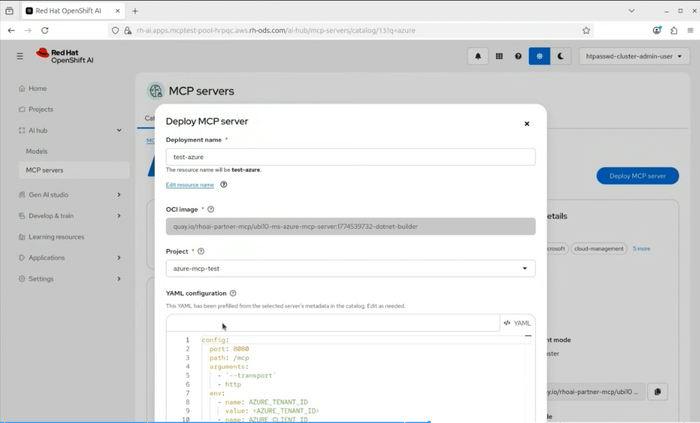

# Deploy ARO Support with Live Azure Troubleshooting

[](https://github.com/rh-ai-quickstart/agentic-partners-integration/actions/workflows/ci.yaml)
[](https://github.com/rh-ai-quickstart/agentic-partners-integration/actions/workflows/security-audit.yml)
[](https://github.com/rh-ai-quickstart/agentic-partners-integration/actions/workflows/ci.yaml)
[](https://github.com/rh-ai-quickstart/agentic-partners-integration/actions/workflows/ci.yaml)
[](https://github.com/rh-ai-quickstart/agentic-partners-integration/actions/workflows/ci.yaml)
[](https://github.com/rh-ai-quickstart/agentic-partners-integration/actions/workflows/ci.yaml)

An AI quickstart that troubleshoots Azure Red Hat® OpenShift® (ARO) issues by connecting to live Azure infrastructure via MCP tool calling.

## Table of Contents

- [Detailed Description](#detailed-description)
  - [See It in Action](#see-it-in-action)
  - [Architecture](#architecture)
- [Requirements](#requirements)
  - [Hardware Requirements](#hardware-requirements)
  - [Minimum Software Requirements](#minimum-software-requirements)
- [Deploy](#deploy)
  - [Prerequisites](#prerequisites)
  - [Deploy on OpenShift (Helm)](#deploy-on-openshift-helm)
  - [Deploy with Docker (Local Development)](#deploy-with-docker-local-development)
- [Troubleshooting](#troubleshooting)
- [Reference](#reference)
- [Key Capabilities](#key-capabilities)
- [Tags](#tags)

## Detailed Description

> **This branch** extends the [Partner Agent Integration Framework](https://github.com/rh-ai-quickstart/agentic-partners-integration) with an ARO Support Agent that uses [Microsoft's Azure MCP Server](https://github.com/microsoft/mcp/tree/main/servers/Azure.Mcp.Server) for live Azure infrastructure troubleshooting via tool calling.
>
> For the core framework (routing, security, RAG, A2A protocol), see the [`main` branch README](https://github.com/rh-ai-quickstart/agentic-partners-integration/tree/main).

When users report ARO infrastructure issues, traditional support agents search a static knowledge base for documented solutions. But infrastructure problems are often unique to the user's environment — a generic runbook can't tell you that *your* pods are using 240Mi of a 256Mi memory limit with traffic spikes at 14:00 UTC.

The ARO Support Agent takes a different approach. Instead of searching tickets, it connects to a live Azure MCP server exposing 40+ tools across Azure services (AKS, Storage, Cosmos DB, Key Vault, Monitor, and more). The LLM dynamically discovers available tools, decides which to invoke based on the user's question, and executes them via the MCP protocol to inspect real infrastructure state before generating a grounded response.

This quickstart demonstrates how to integrate live cloud infrastructure tooling into a multi-agent AI system built on Red Hat OpenShift, using MCP as the standard protocol for tool discovery and execution. The same pattern works for any cloud provider or external service that publishes an MCP server — no framework changes required.

### See It in Action

**[Watch the 5-minute demo video](https://build.microsoft.com/en-US/sessions/ODSP915)** from Microsoft Build 2025 to see the ARO Support Agent troubleshooting live Azure infrastructure, or deploy locally and try it yourself with the test users below.

Once deployed, sign in with one of the test users that have Azure department access:

| User | Access | Try |
|------|--------|-----|
| `carlos@example.com` / `carlos123` | Software + Kubernetes + Azure support | "My pods on ARO keep getting OOMKilled" |
| `sharon@example.com` / `sharon123` | All agents | "List my AKS clusters and their node counts" |
| `luis@example.com` / `luis123` | Network support only | Azure queries denied (no `azure` department) |

The ARO agent inspects live Azure resources and returns answers grounded in real data — not hallucinated. The user can verify every claim by checking the same metrics themselves.

**AI Transparency:** All responses in the chat interface are clearly labeled as AI-generated with a persistent "AI Assistant" badge. Users see disclaimers prompting them to verify agent outputs against actual Azure resources, and the UI displays which tools the agent invoked to generate each response.

### Architecture


**How it works:**

1. The agent receives a question via A2A invoke
2. It connects to the Azure MCP server and fetches available tool definitions
3. It sends the question + tool definitions to the LLM
4. The LLM decides whether to call tools (search an index, list AKS clusters, etc.)
5. If the LLM requests tool calls, the agent executes them via MCP and feeds results back
6. The loop repeats until the LLM produces a final text answer
7. If no MCP server is configured, the agent falls back to answering from LLM knowledge only



The green agents (Software, Network) use **RAG** — they search historical tickets to find documented solutions. The blue agents (Kubernetes, ARO) use **MCP** — they connect to live systems to investigate current state. Different problems need different approaches, but users don't need to know which approach is being used.

For detailed architecture diagrams and the ARO agent's internal structure, see [`aro-partner-agent/README.md`](aro-partner-agent/README.md).

#### Deploying MCP Servers on Red Hat OpenShift AI



For production deployments, MCP servers can be deployed directly through the Red Hat OpenShift AI interface. The MCP servers catalog provides one-click deployment with pre-configured container images, allowing you to deploy Azure MCP servers (or other MCP servers) with automated YAML generation for environment variables, transport configuration, and service endpoints.

## Requirements

### Hardware Requirements

| Deployment Scenario | CPU | RAM | Disk | GPU |
|---------------------|-----|-----|------|-----|
| **External LLM API only** (no local models) | 4 cores | 8 GB | 10 GB free | Not required |
| **Local LLM** (Llama 3.2 3B) + external API fallback | 4 cores | 12 GB | 20 GB free | Not required |
| **Local LLM** (8B+ models) + Azure MCP server | 8 cores | 24 GB | 30 GB free | Not required |

**Guidance:**
- **Minimum (4 cores, 8 GB):** External LLM APIs (OpenAI, Gemini, Anthropic) without local models
- **Recommended (8 cores, 16-24 GB):** Local open-weight models (Llama 3.2, Mistral) for fully open-source deployment
- **Azure MCP server:** Adds ~2 GB RAM overhead when deployed locally as a container

### Minimum Software Requirements

| Software | Version | Purpose |
|----------|---------|---------|
| [Docker](https://docs.docker.com/get-docker/) | 24.0+ | Container runtime for all services |
| [Git](https://git-scm.com/book/en/v2/Getting-Started-Installing-Git) | 2.30+ | Clone the repository |
| [Make](https://www.gnu.org/software/make/) | 4.0+ | Build automation (included on Linux/Mac) |
| [Ollama](https://ollama.com/) | Latest | **Recommended:** Run local open-weight models (Llama 3.2, Mistral, etc.) |
| **Alternative:** LLM API key | — | Any OpenAI-compatible API (OpenAI, Gemini, Anthropic - see [Configuration](docs/configuration.md)) |
| **Optional:** Azure AD app registration | — | Enables live Azure infrastructure troubleshooting via MCP |

## Deploy

Both deployment methods are functionally equivalent — same services, same auth flow, same container images. The only difference is the deployment method and where images are pulled from.

### Prerequisites

**1. Clone the repository:**

```bash
git clone https://github.com/rh-ai-quickstart/agentic-partners-integration
cd agentic-partners-integration
git checkout aro
```

**2. Set up your LLM backend:**

```bash
# Option A: External API (Gemini, OpenAI, Anthropic)
export AI_API_KEY=your-key-here
export AI_PROVIDER=gemini  # or openai, anthropic
export AI_MODEL=gemini-2.5-flash

# Option B: Local open-weight model with Ollama (fully open-source)
docker run -d -p 11434:11434 --name ollama ollama/ollama
docker exec ollama ollama pull llama3.2
export AI_PROVIDER=ollama
export AI_MODEL=llama3.2
export AI_BASE_URL=http://localhost:11434
```

See [Configuration](docs/configuration.md) for all supported backends and model options.

**3. (Optional) Configure Azure credentials for live MCP tools:**

The ARO agent works without Azure credentials (answers from LLM knowledge). To enable live Azure infrastructure inspection, you need an [Azure AD app registration](https://learn.microsoft.com/en-us/cli/azure/azure-cli-sp-tutorial-1) with a client secret, an application ID URI (`api://<client-id>`), and the `Mcp.Tools.ReadWrite.All` app role assigned to the service principal.

```bash
cp azure-mcp-server/.env.example azure-mcp-server/.env
# Edit azure-mcp-server/.env with your credentials:
#   AZURE_TENANT_ID=<your-tenant-id>
#   AZURE_CLIENT_ID=<your-client-id>
#   AZURE_CLIENT_SECRET=<your-client-secret>
#   AZURE_SUBSCRIPTION_ID=<your-subscription-id>
```

The MCP server uses Azure AD JWT Bearer authentication. The ARO agent acquires tokens via OAuth 2.0 `client_credentials` and sends them as `Authorization: Bearer <token>` headers. Both Docker and Helm use this same auth flow.

### Deploy on OpenShift (Helm)

The Helm chart deploys all services to Red Hat OpenShift. Custom images are pulled from `ghcr.io/rh-ai-quickstart` and the Azure MCP server is pulled directly from the Red Hat MCP catalog (`quay.io/rhoai-partner-mcp/ubi10-ms-azure-mcp-server`, pinned to v2.0.0-beta.28).

**Requirements:** OpenShift 4.12+ with `oc` CLI authenticated, Helm 3.8+

**1. Create a project and install the chart:**

```bash
oc new-project partner-agent

helm install partner-agent ./helm \
  --namespace partner-agent \
  --set image.tag=aro \
  --set llm.apiKey='your-api-key' \
  --set llm.provider=gemini \
  --set llm.model=gemini-2.5-flash \
  --set azure.tenantId='your-azure-tenant-id' \
  --set azure.clientId='your-azure-client-id' \
  --set azure.clientSecret='your-azure-client-secret' \
  --set azure.subscriptionId='your-azure-subscription-id' \
  --set networkPolicies.platform=openshift
```

This deploys PostgreSQL with pgvector, Keycloak, OPA, RAG API, Agent Service, Request Manager, Azure MCP Server, ARO Agent, Kubernetes Partner Agent, and the PatternFly Chat UI. Database migrations run automatically.

**2. Wait for pods and create routes:**

```bash
# Wait for all pods to be ready (2-3 minutes)
oc get pods -n partner-agent -w

# Create routes for external access
oc create route edge partner-agent-ui \
  --service=partner-agent-pf-chat-ui \
  --port=http --namespace=partner-agent

oc create route edge partner-agent-keycloak \
  --service=partner-agent-keycloak \
  --port=http --namespace=partner-agent
```

**3. Access the application:**

```bash
# Get the Chat UI URL
oc get route partner-agent-ui -n partner-agent \
  -o jsonpath='https://{.spec.host}{"\n"}'
```

Open the URL and sign in with any of the [test users](#see-it-in-action).

Alternatively, use port-forwarding: `oc port-forward -n partner-agent svc/partner-agent-pf-chat-ui 3000:3000`

**4. Verify:**

```bash
oc get pods -n partner-agent
oc exec deploy/partner-agent-request-manager -n partner-agent \
  -- curl -sf http://localhost:8080/health
```

**Upgrading:**

```bash
helm upgrade partner-agent ./helm \
  --namespace partner-agent \
  --set image.tag=aro \
  --set llm.apiKey='your-api-key' \
  --set azure.tenantId='...' \
  --set azure.clientId='...' \
  --set azure.clientSecret='...' \
  --set azure.subscriptionId='...'
```

**Delete:**

```bash
helm uninstall partner-agent --namespace partner-agent
oc delete project partner-agent
```

For full Helm configuration options (scaling, autoscaling, Ollama, custom values files), see the [Helm chart README](helm/README.md).

### Deploy with Docker (Local Development)

Builds all images locally and runs containers with `make`. The Azure MCP server uses the same Red Hat MCP catalog image.

**Requirements:** Docker 24.0+, Make 4.0+

**1. Build and start all services:**

```bash
make setup
```

If `azure-mcp-server/.env` exists, the Azure MCP server and ARO agent are started with Azure AD auth.

**2. Open the application:**

Navigate to [http://localhost:3000](http://localhost:3000) and sign in with one of the [test users](#see-it-in-action).

**3. Verify:**

```bash
make test
```

**Delete:**

```bash
make clean
```

## Troubleshooting

### Azure MCP server connection fails

**Symptom:** ARO agent responds but doesn't call any Azure tools.

**Diagnosis:**
```bash
# Check the MCP server is running (returns 401 — expected, requires Bearer auth)
curl -s -o /dev/null -w '%{http_code}' http://localhost:5008/

# Check credentials are set
docker exec partner-azure-mcp-server env | grep AZURE_

# Check ARO agent logs for MCP connection attempts
docker logs partner-aro-agent-full 2>&1 | tail -20
```

**Solutions:**
- Verify all 4 Azure environment variables (`AZURE_TENANT_ID`, `AZURE_CLIENT_ID`, `AZURE_CLIENT_SECRET`, `AZURE_SUBSCRIPTION_ID`) are set in `azure-mcp-server/.env`
- Ensure the Azure AD app registration has an application ID URI (`api://<client-id>`) and the `Mcp.Tools.ReadWrite.All` app role assigned
- Check the ARO agent can reach the MCP server: `docker logs partner-aro-agent-full` should show MCP connection attempts

### Ollama model not found

**Symptom:** Error: `model 'llama3.2' not found`

**Solution:**
```bash
docker exec ollama ollama pull llama3.2
# Or switch to a different model
export AI_MODEL=mistral
```

### Port 3000 already in use

**Symptom:** Error: `bind: address already in use` for port 3000

**Solution:**
```bash
# Find and stop the conflicting process
lsof -ti:3000 | xargs kill -9
# Or change the port in the Makefile
```

### Database migration errors

**Symptom:** PostgreSQL connection errors or schema mismatch

**Solution:**
```bash
# Reset the database
make clean
make setup
```

### Authentication fails (Keycloak errors)

**Symptom:** Cannot log in with test users

**Solution:**
1. Verify Keycloak is running: `docker ps | grep keycloak`
2. Check Keycloak logs: `docker logs keycloak`
3. Reset Keycloak data: `make clean && make setup`

### Agent responses are slow

**Symptom:** Queries take 30+ seconds

**Solutions:**
- **Local models:** Upgrade to recommended hardware (8 cores, 16 GB RAM) or switch to a smaller model
- **External APIs:** Check your network connection and API rate limits
- **Azure MCP:** The first tool call is slower due to Azure authentication; subsequent calls use cached credentials

## Reference

| Document | Description |
|----------|-------------|
| [ARO Agent Documentation](aro-partner-agent/README.md) | Full ARO agent docs: Azure credentials, tool filtering, MCP transports, API reference, testing |
| [Getting Started](docs/getting-started.md) | Prerequisites, setup, test users, and first steps |
| [Architecture Overview](docs/architecture.md) | System diagram, request flow, design decisions, project structure |
| [Security (AAA)](docs/aaa-security.md) | SPIFFE workload identity, Keycloak OIDC, OPA authorization, audit trail |
| [A2A Communication](docs/a2a-communication.md) | Agent-to-agent HTTP protocol, endpoint contract, credential propagation |
| [Web UI](docs/web-ui.md) | PatternFly chat interface, pages, nginx architecture |
| [Configuration](docs/configuration.md) | Environment variables, LLM backends (OpenAI-compatible, Ollama) |
| [API Reference](docs/api-reference.md) | Chat, OPA, and A2A endpoint examples with curl |
| [Development](docs/development.md) | Makefile targets, building, testing, local Docker |
| [Production Recommendations](docs/production.md) | Scaling guidance for pgvector, PostgreSQL, Keycloak, OPA, LLM, and more |

**External links:**

- [Azure MCP Server](https://github.com/microsoft/mcp/tree/main/servers/Azure.Mcp.Server) — Microsoft's MCP server for Azure services
- [Partner Agent Integration Framework (main branch)](https://github.com/rh-ai-quickstart/agentic-partners-integration/tree/main) — core framework documentation
- [AI Quickstart Catalog](https://docs.redhat.com/en/learn/ai-quickstarts) — curated collection of AI quickstarts on redhat.com

## Key Capabilities

### Live Infrastructure Troubleshooting via MCP

Unlike RAG-based agents that search static knowledge bases, the ARO agent connects to live Azure infrastructure through the MCP protocol. The LLM discovers available tools at runtime, decides which to invoke, and executes them to inspect real system state before answering.

### Configurable Tool Filter

The Azure MCP server exposes 110+ tools across 40+ Azure services. A configurable tool filter limits which tools the LLM sees (e.g., only `search`, `storage`, `container`, `cosmos`, `monitor`) to keep context windows manageable and responses focused.

### Red Hat MCP Catalog

The Azure MCP server runs from the Red Hat MCP catalog image (`quay.io/rhoai-partner-mcp/ubi10-ms-azure-mcp-server`), pinned to a specific version for stability. Both Docker and Helm deployments use the same image with Azure AD JWT Bearer authentication — no proxy or wrapper needed.

### Ecosystem Extensibility

The MCP integration is not Azure-specific. The same pattern works for any external service that publishes an MCP server. Each new MCP server from any vendor instantly becomes a potential new agent capability — with no framework changes required.

## Tags

- **Industry:** Telecommunications
- **Partner:** Microsoft
- **Product:** Red Hat OpenShift AI
- **Use case:** Support
- **Status:** production-ready
