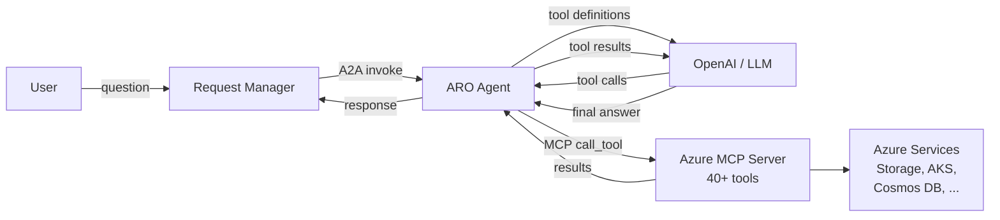
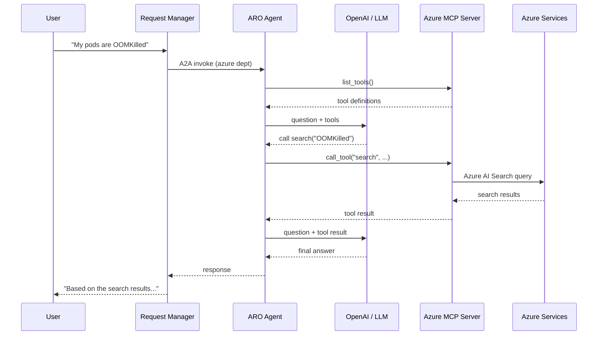
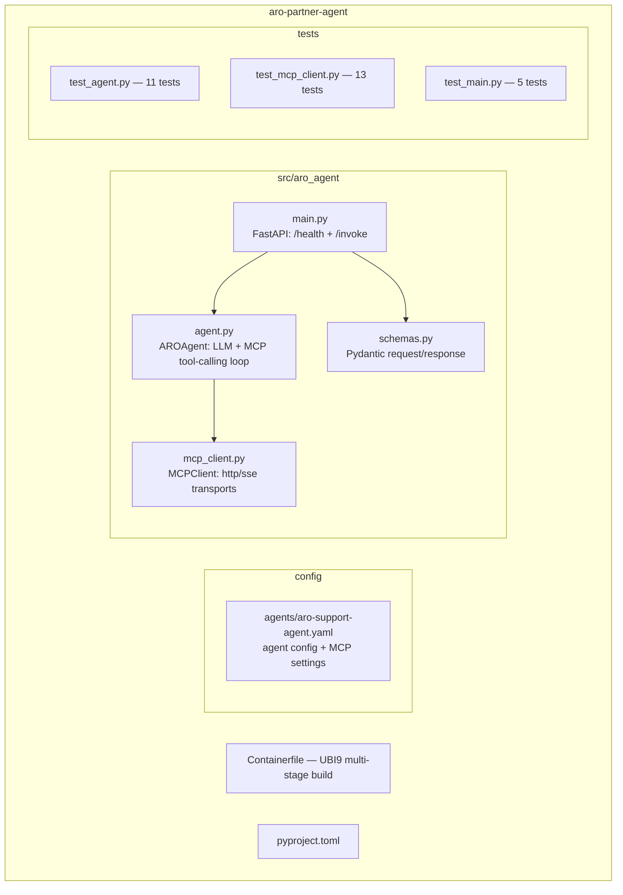

# ARO Partner Agent

Standalone Azure Red Hat OpenShift (ARO) support agent that connects to
Azure services through the [Azure MCP Server](https://github.com/microsoft/mcp/tree/main/servers/Azure.Mcp.Server).

This agent is an **independent black box** — it uses the OpenAI SDK
directly and communicates with the rest of the quickstart only through
the A2A HTTP contract (`POST /api/v1/agents/aro-support/invoke`).

## How it works





1. The agent receives a question via A2A invoke
2. It connects to the Azure MCP server and fetches available tool definitions
3. It sends the question + tool definitions to the LLM
4. The LLM decides whether to call tools (search an index, list AKS clusters, etc.)
5. If the LLM requests tool calls, the agent executes them via MCP and feeds results back
6. The loop repeats until the LLM produces a final text answer
7. If no MCP server is configured, the agent answers using LLM knowledge only

## Prerequisites

- Python 3.12+
- A Google API key for Gemini (default) — or any OpenAI-compatible API
- **Optional:** Azure MCP server + Azure credentials (for live Azure tool access)

## Getting your API keys

### Gemini API key (for the LLM)

1. Go to [Google AI Studio](https://aistudio.google.com/apikey)
2. Click **Create API Key**
3. Select or create a Google Cloud project
4. Copy the key — it starts with `AIza...`

```bash
export GOOGLE_API_KEY=AIza...
```

This is the same `GOOGLE_API_KEY` used by the rest of the quickstart
(agent-service, request-manager, rag-api).

### Azure credentials (for the MCP server)

The Azure MCP server needs Azure credentials to access your resources.

**For local development** — use your existing Azure CLI login:

```bash
az login
az account show  # verify correct subscription
```

No service principal needed. The MCP server piggybacks on your
`az login` session.

**For containers / OpenShift** — create a service principal:

```bash
# Create a service principal with Reader access
az ad sp create-for-rbac --name "mcp-server-sp" \
  --role Reader \
  --scopes /subscriptions/$(az account show --query id -o tsv)

# Output:
# {
#   "appId": "...",     ← AZURE_CLIENT_ID
#   "password": "...",  ← AZURE_CLIENT_SECRET
#   "tenant": "..."     ← AZURE_TENANT_ID
# }

export AZURE_TENANT_ID=<tenant>
export AZURE_CLIENT_ID=<appId>
export AZURE_CLIENT_SECRET=<password>
export AZURE_SUBSCRIPTION_ID=$(az account show --query id -o tsv)
```

> **Note:** `Reader` is enough for read-only operations (list clusters,
> query logs, search indexes). Add `Contributor` if you need write
> operations (create VMs, SQL databases, storage accounts).

## Quick start

### 1. Install dependencies

```bash
cd aro-partner-agent
uv sync
```

### 2. Run without MCP (basic LLM mode)

```bash
GOOGLE_API_KEY=AIza... uv run python -m aro_agent.main
```

The agent starts on port 8080 and answers Azure/ARO questions using LLM
knowledge only. No Azure credentials needed.

```bash
curl -X POST http://localhost:8080/api/v1/agents/aro-support/invoke \
  -H "Content-Type: application/json" \
  -d '{
    "session_id": "test-1",
    "user_id": "carlos@example.com",
    "message": "My pods on ARO keep getting OOMKilled"
  }'
```

### 3. Run with Azure MCP Server (live Azure tools)

#### Start the Azure MCP server

**Option A — npm (local development):**

```bash
# Authenticate with Azure first
az login

# Start the MCP server with HTTP transport
npx -y @azure/mcp@latest server start --transport http
```

The server starts on `http://localhost:5008/mcp` by default.

**Option B — container (production / OpenShift):**

```bash
# Create Azure service principal credentials
az ad sp create-for-rbac --name "mcp-server-sp" --role Reader \
  --scopes /subscriptions/<SUBSCRIPTION_ID>

# Run the container
docker run -d \
  --name azure-mcp-server \
  --network partner-agent-network \
  -e AZURE_TENANT_ID=<TENANT_ID> \
  -e AZURE_CLIENT_ID=<CLIENT_ID> \
  -e AZURE_CLIENT_SECRET=<CLIENT_SECRET> \
  -e AZURE_SUBSCRIPTION_ID=<SUBSCRIPTION_ID> \
  -e ASPNETCORE_URLS=http://+:8080 \
  -e DOTNET_BUNDLE_EXTRACT_BASE_DIR=/tmp/.net \
  -e HOME=/tmp \
  -e ALLOW_INSECURE_EXTERNAL_BINDING=true \
  -p 5008:8080 \
  quay.io/rhoai-partner-mcp/ubi10-ms-azure-mcp-server:1774539732-dotnet-builder \
  --transport http
```

**Option C — RHAOI catalog on OpenShift/ARO:**

Deploy the Azure MCP server from the Red Hat AI on OpenShift MCP catalog.
Create the required secrets first:

```bash
# Azure service principal credentials
kubectl create secret generic azure-sp-credentials \
  --from-literal=tenant-id=<AZURE_TENANT_ID> \
  --from-literal=client-id=<AZURE_CLIENT_ID> \
  --from-literal=client-secret=<AZURE_CLIENT_SECRET>

# Azure AD credentials (for inbound auth on the HTTP transport)
kubectl create secret generic azure-ad-credentials \
  --from-literal=ad-client-id=<AzureAd_ClientId>
```

Then deploy via the RHAOI catalog UI or CLI. The MCP server will be
accessible as a Kubernetes service within the cluster.

#### Start the ARO agent pointing at the MCP server

```bash
GOOGLE_API_KEY=AIza... \
MCP_SERVER_URL=http://localhost:5008/mcp \
uv run python -m aro_agent.main
```

Now the agent has access to 40+ Azure tools. Try:

```bash
# List AKS clusters
curl -s -X POST http://localhost:8080/api/v1/agents/aro-support/invoke \
  -H "Content-Type: application/json" \
  -d '{
    "session_id": "test-2",
    "user_id": "carlos@example.com",
    "message": "List my AKS clusters and their node counts"
  }' | jq .content

# Query Cosmos DB
curl -s -X POST http://localhost:8080/api/v1/agents/aro-support/invoke \
  -H "Content-Type: application/json" \
  -d '{
    "session_id": "test-3",
    "user_id": "carlos@example.com",
    "message": "Show me the databases in my Cosmos DB account"
  }' | jq .content

# Search Azure AI Search
curl -s -X POST http://localhost:8080/api/v1/agents/aro-support/invoke \
  -H "Content-Type: application/json" \
  -d '{
    "session_id": "test-4",
    "user_id": "carlos@example.com",
    "message": "Search our knowledge base for OOMKilled runbooks"
  }' | jq .content
```

### 4. Run with Ollama (free, no API key)

```bash
# Install and start Ollama
curl -fsSL https://ollama.com/install.sh | sh
ollama pull llama3

# Run the ARO agent against local Ollama
OPENAI_API_KEY=unused \
OPENAI_BASE_URL=http://localhost:11434/v1 \
OPENAI_MODEL=llama3 \
uv run python -m aro_agent.main
```

## Running with the full quickstart

The ARO agent integrates with the quickstart via docker-compose or
`scripts/setup.sh`. Users with the **azure** department are routed to
this agent automatically.

```bash
# From the project root
make build
make setup

# Or with docker-compose
docker compose up -d
```

The agent runs on port **8004** and is registered in the agent-service
as `aro-support` with `departments: ["azure"]`.

Test users with azure access:

| User | Password | Departments |
|------|----------|-------------|
| carlos@example.com | carlos123 | software, kubernetes, **azure** |
| sharon@example.com | sharon123 | software, network, kubernetes, **azure** (admin) |

## Configuration

The agent is configured via `config/agents/aro-support-agent.yaml`:

```yaml
name: "aro-support"
departments: ["azure"]
llm_model: "gemini-2.5-flash"

mcp_servers:
  - name: azure
    url: "http://azure-mcp-server:8080/mcp"
    transport: "http"          # "http" (StreamableHTTP) or "sse"
    tool_filter:               # only expose tools containing these keywords
      - search
      - storage
      - container
      - cosmos
      - sql
      - keyvault
      - monitor
```

### Environment variables

| Variable | Required | Default | Description |
|----------|----------|---------|-------------|
| `GOOGLE_API_KEY` | Yes* | — | Google Gemini API key (default LLM) |
| `OPENAI_API_KEY` | Yes* | `not-set` | Alternative: OpenAI or compatible API key |
| `OPENAI_BASE_URL` | No | Gemini endpoint | Override for Azure OpenAI, Ollama, etc. |
| `OPENAI_MODEL` | No | `gemini-2.5-flash` | LLM model to use |
| `MCP_SERVER_URL` | No | from YAML config | MCP server endpoint (overrides YAML) |
| `MCP_TRANSPORT` | No | `http` | MCP transport: `http` or `sse` |
| `LOG_LEVEL` | No | `INFO` | Logging level |
| `PORT` | No | `8080` | Server port |

\* Provide either `GOOGLE_API_KEY` (preferred) or `OPENAI_API_KEY`.

### MCP tool filter

The `tool_filter` in the config limits which tools the LLM sees. Each
entry is a **keyword** — any tool whose name contains the keyword is
included. For example, `storage` matches `get_azure_storage_details`,
`create_azure_storage_account`, etc. The Azure MCP server exposes
110 tools across 40+ Azure services:

| Filter keyword | Example tools matched |
|---------------|----------------------|
| `search` | `search_azure_ai_index`, `get_azure_ai_search_details` |
| `storage` | `get_azure_storage_details`, `create_azure_storage_account` |
| `container` | `get_azure_container_details`, `create_azure_container_app` |
| `cosmos` | `get_azure_cosmos_details`, `create_azure_cosmos_database` |
| `sql` | `get_azure_sql_details`, `create_azure_sql_database` |
| `keyvault` | `get_azure_keyvault_details`, `create_azure_keyvault_secret` |
| `monitor` | `get_azure_monitor_details`, `get_azure_monitor_metrics` |
| `compute` | `get_azure_compute_details`, `create_azure_vm` |
| `postgres` | `get_azure_postgres_details` |
| `redis` | `get_azure_redis_details`, `create_azure_redis_cache` |

Remove `tool_filter` entirely to expose all 110 tools to the LLM.

### MCP transports

| Transport | Config value | URL pattern | Use case |
|-----------|-------------|-------------|----------|
| StreamableHTTP | `http` (default) | `/mcp` | Azure MCP server, production deployments |
| Server-Sent Events | `sse` | `/sse` | Legacy MCP servers |

## API

### `POST /api/v1/agents/aro-support/invoke`

```json
{
  "session_id": "abc-123",
  "user_id": "carlos@example.com",
  "message": "My pods on ARO keep getting OOMKilled",
  "transfer_context": {
    "conversation_history": [
      {"role": "user", "content": "previous message"},
      {"role": "assistant", "content": "previous response"}
    ]
  }
}
```

Response:

```json
{
  "content": "Based on the AKS cluster data, your pods are hitting ...",
  "agent_id": "aro-support",
  "session_id": "abc-123",
  "metadata": {
    "mcp_enabled": true
  }
}
```

### `GET /health`

```json
{
  "status": "healthy",
  "service": "aro-partner-agent",
  "version": "0.1.0",
  "mcp_configured": true,
  "timestamp": "2026-04-20T12:00:00Z"
}
```

## Tests

```bash
uv run pytest tests/ -v
```

29 tests covering the agent, MCP client, and FastAPI endpoints.
All tests are fully mocked — no API keys or MCP server needed.

## Architecture

This agent is a **fully independent black box**. It shares no code
with the other agents in the quickstart — only the A2A HTTP contract.
A partner could rewrite this agent in any language or framework and
the quickstart would work identically, as long as the invoke endpoint
returns the same JSON schema.


