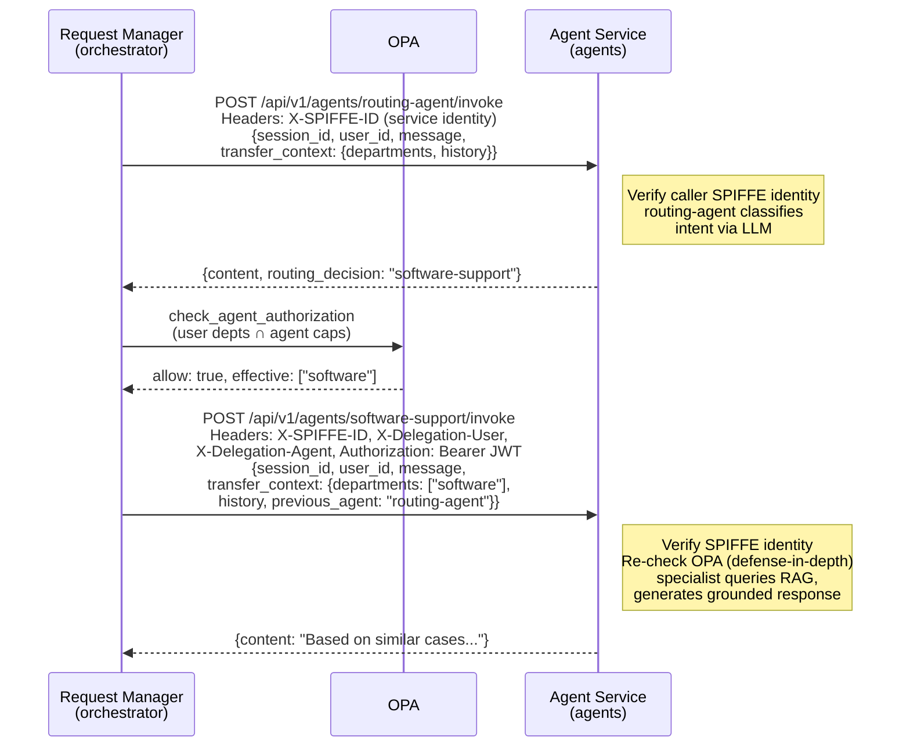
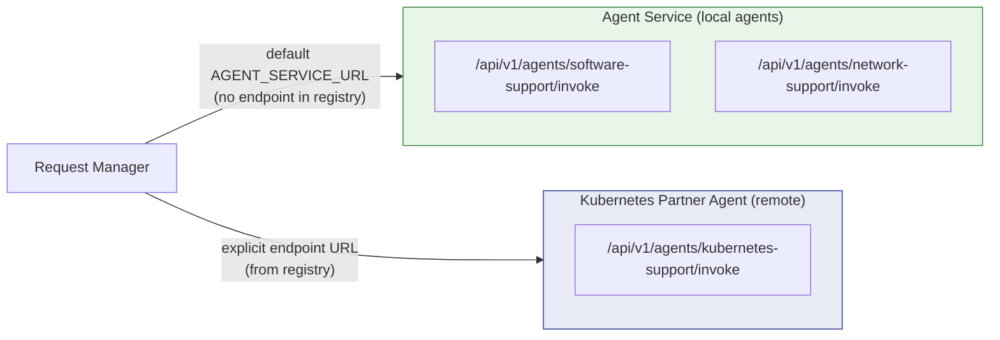
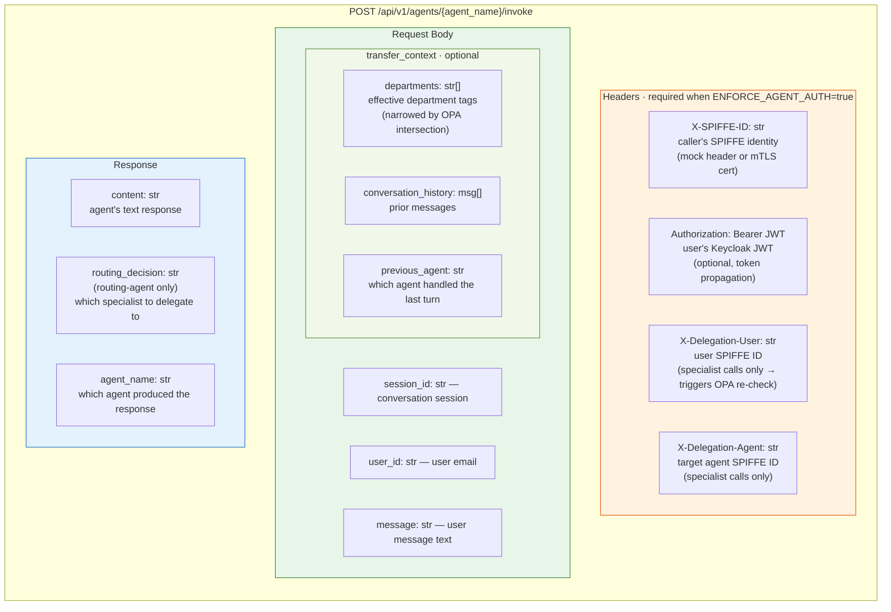

# A2A -- Agent-to-Agent Communication

All inter-agent communication uses exclusively HTTP-based A2A (Agent-to-Agent) calls. There is no message broker, no event bus, no shared memory -- agents talk directly over HTTP.

## Communication Pattern



## How It Works

1. **`DirectHTTPStrategy`** in `communication_strategy.py` handles all A2A communication.
2. **Agent registry discovery:** On first request, `_ensure_registry()` calls `GET /api/v1/agents/registry` on the agent-service. The registry returns each specialist agent's departments and description. **Remote agents** (those with an `endpoint` field in their YAML config) also include their invoke URL. Local agents have no `endpoint` — the request-manager uses its default `AGENT_SERVICE_URL` for them.
3. **`EnhancedAgentClient`** (`agent_client_enhanced.py`) sends `POST /api/v1/agents/{agent_name}/invoke` with SPIFFE identity, delegation headers, and JWT. For **local agents**, the POST goes to the agent-service. For **remote agents**, the POST goes directly to the remote host URL from the registry — bypassing the agent-service for the specialist call.
4. **`transfer_context`** carries the user's `departments` (narrowed to effective scope after OPA), `conversation_history`, and `previous_agent` across each A2A call, so the receiving agent has full context.
5. **Two-hop routing:** The request-manager first invokes the routing-agent (service-to-service, no delegation). If the response contains a `routing_decision`, the request-manager queries OPA for authorization, reduces scope to `effective_departments`, then makes a second A2A call to the specialist agent with delegation headers.
6. **Defense-in-depth OPA enforcement:** The request-manager queries OPA before each specialist invocation (primary gate). The agent-service also verifies caller SPIFFE identity and re-checks OPA when delegation headers are present (secondary gate). If the primary gate is bypassed, the secondary gate blocks the request.
7. **Credential propagation:** `CredentialService` stores the user's JWT in request-scoped context vars. `outbound_identity_headers()` builds SPIFFE and delegation headers. Both are attached to outbound A2A calls by `EnhancedAgentClient`.
8. **Audit at every hop:** After each A2A call completes, `_complete_request_log()` records the responding agent, full response, and processing time in `request_logs`.

## Local vs Remote Agent Routing

Both agent types implement the same `POST /api/v1/agents/{name}/invoke` contract with the same request/response schema. The request-manager is unaware of the deployment model — it simply sends HTTP to the URL it obtained from the registry.



The registry response format:

```json
{
  "agents": {
    "software-support": {
      "departments": ["software"],
      "description": "Handles software issues..."
    },
    "kubernetes-support": {
      "departments": ["kubernetes"],
      "description": "Handles Kubernetes issues...",
      "endpoint": "http://partner-kubernetes-agent-full:8080/api/v1/agents/kubernetes-support/invoke"
    }
  }
}
```

Agents **without** an `endpoint` field are local — the request-manager uses its default URL. Agents **with** an `endpoint` are remote — the request-manager routes directly to that URL.

## A2A Endpoint Contract



## Why A2A Instead of an Event Bus

- **Simplicity:** No broker infrastructure to deploy and manage.
- **Synchronous responses:** The user waits for a response -- direct HTTP keeps the architecture straightforward.
- **Observability:** Each A2A call is a simple HTTP request with full audit. No message delivery guarantees to debug.
- **Horizontal scaling:** Agents are stateless HTTP services. Scale by adding replicas behind a load balancer.
