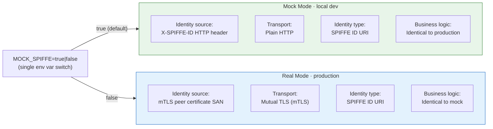
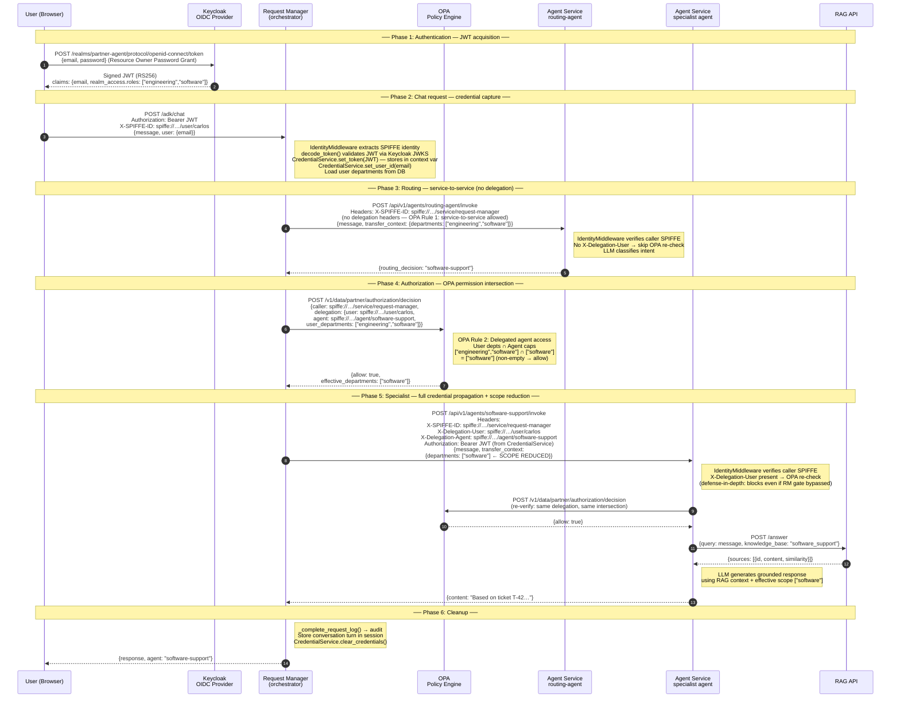
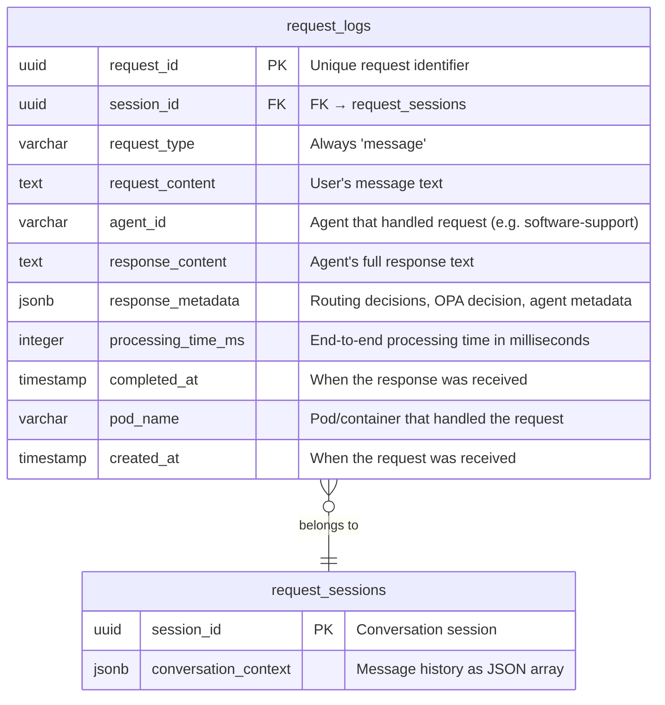
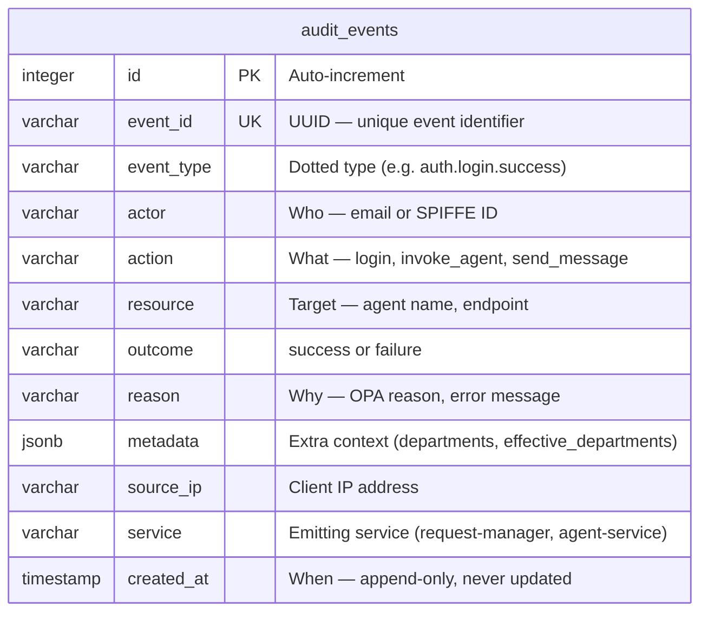

# AAA -- Authentication, Authorization, and Audit

The system implements a Zero Trust AAA framework using **SPIFFE workload identity** for authentication, **OPA (Open Policy Agent)** for authorization, and PostgreSQL-backed audit for every request.

## Authentication -- SPIFFE Workload Identity

Instead of passwords and JWT tokens, services authenticate using **SPIFFE IDs** (Secure Production Identity Framework for Everyone). Each service and user is identified by a URI like `spiffe://partner.example.com/user/carlos`.



**How it works:**

1. A single environment variable `MOCK_SPIFFE=true` (default) switches between mock and real mode
2. In **mock mode**, the `X-SPIFFE-ID` header carries identity -- no certificates needed for local dev
3. In **real mode**, SPIFFE IDs are extracted from mTLS peer certificate Subject Alternative Names
4. The `IdentityMiddleware` (FastAPI middleware) extracts identity and sets `request.state.identity`
5. All downstream code uses the same `WorkloadIdentity` dataclass regardless of mode

The mock pattern has only 4 switching points (all in `shared-models/src/shared_models/identity.py`):
- **Inbound identity extraction**: header vs. peer certificate
- **Outbound identity headers**: X-SPIFFE-ID header vs. mTLS client cert
- **Server mode**: plain HTTP vs. TLS
- **Client mode**: plain HTTP vs. mTLS

## User Authentication -- Keycloak OIDC

User authentication is handled by **Keycloak** (OIDC Identity Provider). A pre-configured Keycloak container starts with `docker compose up`, with the realm `partner-agent`, the 4 test users, and department roles ready to go. Only users configured in Keycloak can log in.

**Auth flow:**

1. UI sends `POST /auth/login` with `{email, password}` to request-manager
2. Request-manager performs a **Resource Owner Password Grant** against Keycloak's token endpoint
3. Keycloak validates credentials and returns a signed JWT (RS256)
4. Request-manager validates the JWT via Keycloak's **JWKS endpoint** and returns `{token, user: {email, role, departments}}`
5. UI stores the JWT and sends it as `Authorization: Bearer` header on subsequent requests

**Auth endpoints** (served by request-manager):

| Endpoint | Method | Description |
|----------|--------|-------------|
| `/auth/login` | POST | `{email, password}` -> `{token, user: {email, role, departments}}` |
| `/auth/me` | GET | Validate Keycloak JWT, return user info |
| `/auth/refresh` | POST | Re-validate JWT |
| `/auth/config` | GET | Return `{keycloak_url, keycloak_realm, client_id}` |

**Pre-configured users** (in `keycloak/realm-partner.json`):

| User | Password | Keycloak Roles (departments) |
|------|----------|------------------------------|
| carlos@example.com | carlos123 | engineering, software, kubernetes |
| luis@example.com | luis123 | engineering, network |
| sharon@example.com | sharon123 | engineering, software, network, kubernetes, admin |
| josh@example.com | josh123 | _(none)_ |

Departments are extracted from Keycloak's `realm_access.roles` claim in the JWT. The Keycloak realm export is at `keycloak/realm-partner.json`.

## Authorization -- OPA + Permission Intersection

Authorization is enforced by **OPA (Open Policy Agent)** using Rego policies. The core model is **permission intersection**:

```
Effective Access = User Departments ∩ Agent Capabilities
```

When a user delegates access to an agent, the agent can only operate within departments that **both** the user and the agent have access to.

**OPA policies** (in `policies/`):

| File | Purpose |
|------|---------|
| `user_permissions.rego` | Maps users to departments (fallback for local dev) |
| `agent_permissions.rego` | **Auto-generated** — maps agents to department capabilities |
| `delegation.rego` | Main authorization rules + permission intersection logic |

**Agent capabilities** are defined in each agent's YAML config (`agent-service/config/agents/*.yaml`) via the `departments` field and synced to OPA by `scripts/sync_agent_capabilities.py` (run via `make sync-agents` or automatically during `make build`). Example:

| Agent | Capabilities | Source |
|-------|-------------|--------|
| routing-agent | _(union of all specialist departments + admin)_ | auto-derived |
| software-support | software | `software-support-agent.yaml` |
| network-support | network | `network-support-agent.yaml` |
| kubernetes-support | kubernetes | `kubernetes-support-agent.yaml` |

**User departments** (from DB or `user_permissions.rego` fallback):

| User | Departments | Can Access |
|------|-------------|------------|
| carlos@example.com | engineering, software, kubernetes | software-support, kubernetes-support |
| luis@example.com | engineering, network | network-support |
| sharon@example.com | engineering, software, network, kubernetes, admin | all agents |
| josh@example.com | _(none)_ | no agents |

**Example intersection**: Carlos (departments: `[engineering, software, kubernetes]`) + software-support (capabilities: `[software]`) = effective: `[software]` -- access granted. Carlos + kubernetes-support (capabilities: `[kubernetes]`) = effective: `[kubernetes]` -- access granted. Carlos + network-support (capabilities: `[network]`) = effective: `[]` -- access denied.

**Authorization enforcement** happens at four layers (defense-in-depth):

| Layer | Where | How |
|-------|-------|-----|
| OPA hard gate (primary) | Request Manager | `communication_strategy.py` queries OPA before every specialist A2A call; blocks unauthorized routing regardless of LLM output |
| OPA hard gate (defense-in-depth) | Agent Service | `main.py` verifies caller identity via SPIFFE and re-checks OPA when delegation headers are present (`X-Delegation-User`); blocks direct calls from unauthorized agents or services |
| LLM prompt | Agent Service | Routing-agent's system prompt is built dynamically from agent YAML configs — lists only agents whose `departments` overlap with the user's; LLM won't route to others |
| UI filtering | Chat UI | The UI filters available agents based on user departments |

**Scope reduction:** After the OPA intersection check, the specialist agent receives only the **effective departments** (the intersection result), not the user's full department list. This ensures agents operate within the narrowest possible authority.

**Token & credential propagation:** The request-manager propagates three types of credentials on A2A calls:
- **JWT** (via `Authorization: Bearer` header) -- the user's Keycloak token, forwarded via `CredentialService`
- **SPIFFE identity** (via `X-SPIFFE-ID` header in mock mode, mTLS in production) -- identifies the calling service
- **Delegation headers** (`X-Delegation-User`, `X-Delegation-Agent`) -- carry the user's SPIFFE ID and target agent for OPA re-verification at the agent-service

## Token, Policy & Scope -- End-to-End Flow



**OPA policy rules** (from `delegation.rego`):

1. **Service-to-service** (no delegation): Always allowed (infrastructure calls)
2. **Delegated agent access**: Compute intersection, allow if non-empty
3. **Autonomous agent access**: Always denied (agents require user delegation context)
4. **Unknown agent**: Denied (agent not in capabilities map)

## Audit

Every request is logged in the `request_logs` table with a complete audit trail:



The audit write-back happens in `communication_strategy.py` after each A2A call completes. The `_complete_request_log()` method updates the `RequestLog` row with the response data, agent identity, and timing.

Session-level audit is stored in `request_sessions.conversation_context`, which records every message and response in the conversation as a JSON array.

The audit trail is queryable via the **Audit page** (`audit.html`), which calls `GET /adk/audit` and displays a table of all request logs.

## SOC 2 Audit Events (CC7.1, CC7.2)

In addition to request audit, the system maintains an append-only `audit_events` table that captures security-relevant events across all services. This satisfies SOC 2 Trust Service Criteria CC7.1 (monitoring) and CC7.2 (anomaly detection).



**Event types captured:**

| Event Type | Where | Trigger |
|------------|-------|---------|
| `auth.login.success` | Request Manager | User authenticates via Keycloak |
| `auth.login.failure` | Request Manager | Invalid credentials |
| `auth.token.expired` | Request Manager | JWT expired on validation |
| `auth.token.invalid` | Request Manager | JWT malformed or signature invalid |
| `authz.allow` | Request Manager, Agent Service | OPA permits agent access |
| `authz.deny` | Request Manager, Agent Service | OPA blocks agent access |
| `authz.routing_direct` | Request Manager | Routing-agent handled request directly without delegating (soft deny) |
| `authz.no_identity` | Agent Service | Request missing SPIFFE identity |
| `data.chat.request` | Request Manager | User sends a chat message |
| `data.audit.access` | Request Manager | User views the audit log |

**Design principles:**

- **Append-only:** The table is never UPDATEd or DELETEd in normal operation. Events are immutable once written.
- **Independent transactions:** Each audit event is written in its own database session (`AuditService.emit()`), so events are persisted even when the business transaction rolls back.
- **Fire-and-forget:** A failed audit write logs an error but never crashes the calling request.
- **Dual-layer coverage:** Both request-manager (primary OPA gate) and agent-service (defense-in-depth gate) emit audit events, providing correlated records across service boundaries.

**Viewing audit events:** The audit trail is viewable via the **Audit Trail page** (`audit-events.html`), which calls `GET /adk/audit-events` and displays a filterable table of all events with expandable detail rows. Admin users see all events; regular users see only their own. Supports filtering by event type and outcome.
