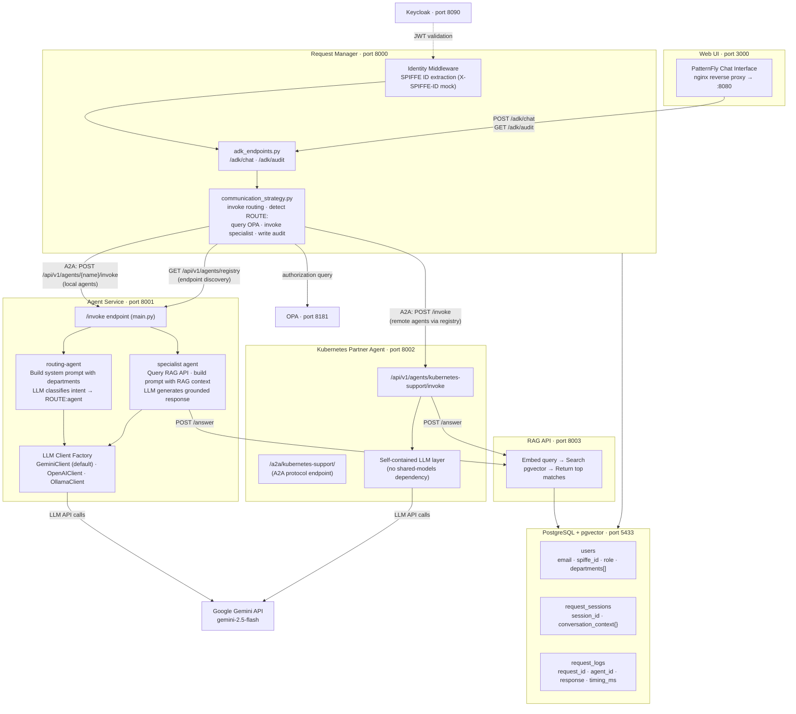
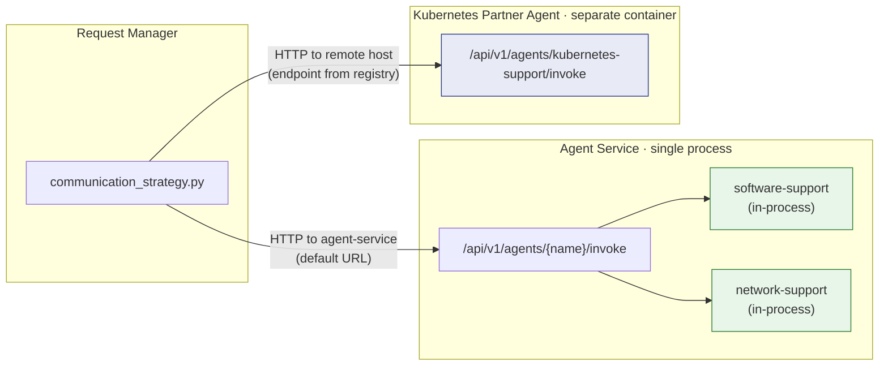
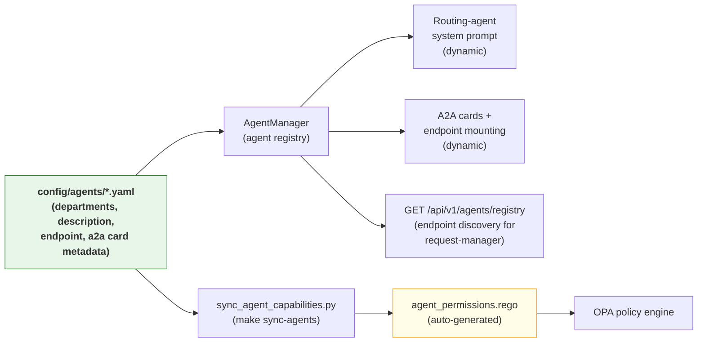

# Architecture Overview

## System Diagram



## Services

| Service | Port | Role |
|---------|------|------|
| PostgreSQL (pgvector) | 5433 | User data, sessions, audit logs, and vector storage for RAG |
| RAG API | 8003 | Semantic search over support tickets |
| Agent Service | 8001 | LLM-based routing and specialist agents |
| Kubernetes Partner Agent | 8002 | Standalone remote Kubernetes support agent (partner agent demo) |
| Request Manager | 8000 | AAA enforcement, A2A orchestration, chat API |
| OPA | 8181 | Policy engine for authorization (Rego policies) |
| Keycloak | 8090 | OIDC identity provider (user authentication) |
| Web UI (nginx) | 3000 | PatternFly chat interface |

> **Note:** Ports above are for `make setup` (uses `scripts/setup.sh`). The `docker-compose.yaml` uses different host port mappings: PostgreSQL on 5432, RAG API on 8080. Internal container ports remain the same.

## Request Flow

1. **User sends message** -- Web UI sends `POST /adk/chat` with user email and message text.
2. **Identity & credential capture** -- `IdentityMiddleware` extracts SPIFFE identity (from `X-SPIFFE-ID` header in mock mode). JWT is decoded and stored in `CredentialService` for downstream propagation. Request Manager resolves user from PostgreSQL, loads departments.
3. **Agent registry discovery** -- On first request, Request Manager calls `GET /api/v1/agents/registry` on the agent-service to discover per-agent invoke URLs. Local agents use the default agent-service URL; remote agents use their configured `endpoint`. The registry is cached for the lifetime of the strategy instance.
4. **A2A call: routing-agent** -- Request Manager invokes `POST /api/v1/agents/routing-agent/invoke` via A2A, passing `transfer_context` with `departments` and `conversation_history`. Outbound call includes `X-SPIFFE-ID` header (service identity) but no delegation headers (this is a service-to-service call).
5. **Routing decision** -- Routing-agent's LLM classifies intent using a dynamically built system prompt (derived from agent YAML configs). Returns `ROUTE:<agent-name>` or a conversational response.
6. **OPA authorization + scope reduction** -- If routing to a specialist, Request Manager queries OPA with `Delegation(user_spiffe_id, agent_spiffe_id, user_departments)`. OPA computes `User Departments ∩ Agent Capabilities`. Blocked if intersection is empty. The **effective departments** (intersection result) replace the user's full departments in the downstream `transfer_context`.
7. **A2A call: specialist agent** -- Request Manager invokes the specialist via A2A using the per-agent endpoint URL from the registry. Includes delegation headers (`X-Delegation-User`, `X-Delegation-Agent`), JWT, and the narrowed `effective_departments`. For remote agents, the request goes directly to the remote host. Agent-service verifies caller identity via SPIFFE and re-checks OPA authorization (defense-in-depth). Specialist queries RAG API, gets matching tickets, builds LLM prompt with RAG context, returns grounded response.
8. **Audit** -- `_complete_request_log()` updates `request_logs` with `agent_id`, `response_content`, `processing_time_ms`, `completed_at`.
9. **Response** -- Request Manager stores conversation turn in `request_sessions.conversation_context`, returns response to the UI.

## Agent Deployment Models: Local vs Remote

The system supports two deployment models for specialist agents. Both use the same A2A HTTP API contract (`POST /api/v1/agents/{name}/invoke`) and the same YAML config format, but differ in where the agent process runs and how network traffic flows.



**Local agents** (software-support, network-support) run inside the agent-service process. The agent-service's FastAPI `/invoke` endpoint dispatches to the correct `Agent` instance by name. No separate container or network hop is required — the request-manager sends HTTP to the agent-service, which handles routing and LLM calls in-process.

- YAML config: no `endpoint` field
- Registry response: no `endpoint` returned — request-manager uses its default `AGENT_SERVICE_URL`
- Networking: request-manager -> agent-service (single HTTP hop on `partner-agent-network`)
- Dependencies: shares `shared-models`, LLM clients, and config with agent-service

**Remote agents** (kubernetes-support) run as standalone containers with their own FastAPI process, LLM layer, and dependencies. The agent-service's YAML config has an `endpoint` field pointing to the remote container's invoke URL. The request-manager discovers this URL via the registry and sends HTTP directly to the remote agent — bypassing the agent-service for the specialist call.

- YAML config: `endpoint: "http://partner-kubernetes-agent-full:8080/api/v1/agents/kubernetes-support/invoke"`
- Registry response: includes `endpoint` — request-manager routes directly to the remote host
- Networking: request-manager -> remote agent container (HTTP on `partner-agent-network`)
- Dependencies: fully standalone — no `shared-models` dependency, own `Containerfile`, own LLM clients

**Network topology:** All containers join the `partner-agent-network` Docker bridge network. Containers resolve each other by container name (e.g., `partner-agent-service-full`, `partner-kubernetes-agent-full`). Port 8080 is the internal container port for all services; host port mappings (8000-8003) are for external access only. Inter-container communication always uses port 8080 on the container name.

**Registry endpoint (`GET /api/v1/agents/registry`):** Returns all specialist agents with their departments and descriptions. Only remote agents include an `endpoint` field. The request-manager caches the registry on first use and routes accordingly:
- Agent with `endpoint` in registry -> HTTP to that URL
- Agent without `endpoint` -> HTTP to default `AGENT_SERVICE_URL` (the agent-service)

## Key Design Decisions

- **Single-turn routing:** The routing-agent classifies intent in one LLM call (no multi-turn state machine). Returns `ROUTE:<agent>` or a conversational response.
- **Mandatory RAG:** Specialist agents always query the RAG API. If RAG is unavailable, the request fails (no silent degradation).
- **OPA + permission intersection:** Authorization uses `User Departments ∩ Agent Capabilities` evaluated by OPA. The LLM can't bypass the OPA hard gate.
- **Full audit:** Every A2A call records which agent handled the request, the response, and processing time.
- **A2A exclusively:** No message brokers. Agents communicate via synchronous HTTP calls.
- **Pluggable LLM:** Backend configured via `LLM_BACKEND` env var. Supports Gemini (default in setup), OpenAI, and Ollama.
- **Uniform API contract:** Both local and remote agents implement the same `POST /api/v1/agents/{name}/invoke` endpoint with the same request/response schema (`AgentInvokeRequest`/`AgentInvokeResponse`). This makes agent deployment transparent to the request-manager.

## Conversation Context

Each chat session maintains conversation history in `request_sessions.conversation_context.messages`:

```json
{
  "messages": [
    {"role": "user", "content": "My app crashes with error 500"},
    {"role": "assistant", "content": "...", "agent": "software-support"},
    {"role": "user", "content": "It happens when I click submit"},
    {"role": "assistant", "content": "...", "agent": "software-support"}
  ]
}
```

- **Sent to routing-agent:** Last 20 messages (for intent classification with context)
- **Sent to specialist agents:** Last 10 messages (for follow-up handling)
- **Max stored:** 40 messages (oldest trimmed)

## Dynamic Agent Registry

Agent YAML configs are the single source of truth. All downstream systems derive their agent knowledge from these files — no hardcoded agent lists anywhere in the codebase.



**To add a new agent**, create a YAML file and run `make build`:

1. `agent-service/config/agents/database-support-agent.yaml` — define `name`, `departments`, `description`, `llm_*`, `system_message`, and `a2a` skills
2. `make sync-agents` regenerates `policies/agent_permissions.rego` from all agent YAMLs
3. `make build` calls `sync-agents` automatically, then builds container images
4. On startup, `AgentManager` discovers the new agent, the routing-agent prompt includes it, and the A2A endpoint is mounted

## Agent Configuration

Each agent's YAML config is the **single source of truth** for that agent's identity, capabilities, and A2A card metadata. Agents are auto-discovered from `agent-service/config/agents/*.yaml` at startup.

| Field | Purpose |
|-------|---------|
| `name` | Agent registration key. Must match the name used in `/invoke` URL. |
| `description` | Routing description — used by routing-agent to classify user intent. |
| `departments` | Department capabilities — used for OPA authorization and routing decisions. |
| `endpoint` | *(optional)* Full invoke URL for remote agents. When omitted, agent runs locally in the agent-service process. |
| `llm_backend` | Which LLM provider to use (gemini, openai, ollama). |
| `llm_model` | Model name passed to the provider. |
| `system_message` | System prompt prepended to every LLM call. |
| `sampling_params` | Temperature, top_p, and other sampling configuration. |
| `a2a` | A2A agent card metadata (card_name, card_description, skills). |

Example (`software-support-agent.yaml`):

```yaml
name: "software-support"
description: "Handles software issues, bugs, errors, crashes, application problems"
departments: ["software"]
llm_backend: "gemini"
llm_model: "gemini-2.5-flash"
system_message: |
  You are a software support specialist...
sampling_params:
  strategy:
    type: "top_p"
    temperature: 0.7
    top_p: 0.95
a2a:
  card_name: "Software Support Agent"
  card_description: "Software support specialist..."
  skills:
    - id: software_troubleshooting
      name: "Software Troubleshooting"
      description: "Diagnoses and resolves software issues..."
      tags: ["software", "bugs", "errors"]
      examples: ["My application keeps crashing"]
```

**Adding a new local agent** requires only:
1. Create a new YAML file in `agent-service/config/agents/`
2. Run `make sync-agents` (or `make build`, which includes sync)
3. Rebuild and restart

**Adding a remote agent** (running in a separate container/host):
1. Create a YAML file with an `endpoint` field pointing to the remote agent's invoke URL:
   ```yaml
   name: "database-support"
   description: "Handles database issues, queries, performance, migrations"
   departments: ["database"]
   endpoint: "http://database-agent:9090/api/v1/agents/database-support/invoke"
   ```
2. The remote agent must implement the same `/api/v1/agents/{name}/invoke` API contract
3. Run `make sync-agents` to update OPA policies, then rebuild and restart

**End-to-end example: `kubernetes-partner-agent/`** — This directory is a fully standalone partner agent service that demonstrates the remote agent pattern. It has zero dependencies on `shared-models` or `agent-service`, its own LLM abstraction layer, Containerfile, and test suite. The agent-service's `kubernetes-support-agent.yaml` has `endpoint: "http://partner-kubernetes-agent-full:8080/api/v1/agents/kubernetes-support/invoke"` which routes requests to the partner agent container via the Docker network.

The system automatically derives:
- Routing-agent system prompt (from `description` and `departments`)
- OPA capabilities policy (from `departments`, via `scripts/sync_agent_capabilities.py`)
- A2A agent cards and endpoint mounting (from `a2a` section)

Available agents:

| File | Agent Name | Deployment | Role |
|------|-----------|------------|------|
| `routing-agent.yaml` | `routing-agent` | Local | Classifies user intent and routes to the correct specialist |
| `software-support-agent.yaml` | `software-support` | Local | Resolves software issues using RAG-backed knowledge base |
| `network-support-agent.yaml` | `network-support` | Local | Resolves network issues using RAG-backed knowledge base |
| `kubernetes-support-agent.yaml` | `kubernetes-support` | **Remote** | Resolves Kubernetes/container orchestration issues (separate container on port 8002) |

## Project Structure

```mermaid
flowchart TD
    root["agentic-partners-integration"]

    root --> as["agent-service/\nAI agent processing service"]
    as --> as_cfg["config/agents/\nAgent YAML configs\n(single source of truth for\nagent capabilities, descriptions,\nand A2A card metadata)"]
    as --> as_src["src/agent_service/"]
    as_src --> as_main["main.py — FastAPI app, /invoke endpoint, dynamic routing + RAG"]
    as_src --> as_agents["agents.py — AgentManager: dynamic registry, dept map, descriptions"]
    as_src --> as_llm["llm/ — Pluggable LLM clients (Gemini, OpenAI, Ollama)"]
    as_src --> as_schemas["schemas.py — Request/response models for /invoke"]

    root --> rm["request-manager/\nAAA enforcement, A2A orchestration"]
    rm --> rm_src["src/request_manager/"]
    rm_src --> rm_main["main.py — FastAPI app, IdentityMiddleware, session cleanup"]
    rm_src --> rm_adk["adk_endpoints.py — /adk/chat, /adk/audit (chat + audit API)"]
    rm_src --> rm_cs["communication_strategy.py — A2A invocation, OPA hard gate, audit"]
    rm_src --> rm_ac["agent_client_enhanced.py — HTTP client for A2A calls"]
    rm_src --> rm_cred["credential_service.py — Request-scoped credential management"]

    root --> rag["rag-service/\nRAG API (pgvector + Gemini embeddings)"]
    rag --> rag_svc["rag_service.py — FastAPI service for /answer endpoint"]
    rag --> rag_ingest["ingest_knowledge.py — Data ingestion script"]

    root --> ui["pf-chat-ui/\nPatternFly chat web UI"]
    ui --> ui_static["static/"]
    ui_static --> ui_index["index.html — Landing page (redirects to login or chat)"]
    ui_static --> ui_login["login.html — Login page with JWT authentication"]
    ui_static --> ui_chat["chat.html — Chat interface with PF6 components"]
    ui_static --> ui_audit["audit.html — Request audit log viewer"]
    ui_static --> ui_events["audit-events.html — Audit trail viewer"]
    ui --> ui_nginx["nginx.conf — Reverse proxy to request-manager"]

    root --> k8s["kubernetes-partner-agent/\nStandalone remote Kubernetes agent\n(no shared-models dependency)"]
    k8s --> k8s_src["src/kubernetes_agent/"]
    k8s_src --> k8s_main["main.py — FastAPI app, /invoke + A2A"]
    k8s_src --> k8s_agent["agent.py — KubernetesAgent with LLM"]
    k8s_src --> k8s_llm["llm/ — Self-contained LLM clients"]
    k8s --> k8s_cfg["config/agents/ — Agent YAML config"]

    root --> shared["shared-models/\nShared library: DB models, migrations, identity, OPA client"]
    root --> kc["keycloak/\nKeycloak realm config (OIDC)"]

    root --> pol["policies/\nOPA Rego policies (authorization rules)"]
    pol --> pol_user["user_permissions.rego — User-to-department mappings"]
    pol --> pol_agent["agent_permissions.rego — Auto-generated agent capabilities"]
    pol --> pol_deleg["delegation.rego — Permission intersection logic"]
    pol --> pol_test["delegation_test.rego — Policy tests"]

    root --> data["data/ — Synthetic support tickets (JSON)"]
    root --> scripts["scripts/ — Setup, build, test, sync_agent_capabilities"]
    root --> helm["helm/ — Helm chart for Kubernetes/OpenShift deployment"]
    root --> makefile["Makefile — Build, test, lint, and deploy targets"]
    root --> compose["docker-compose.yaml — Full stack compose file"]

    style root fill:#f5f5f5,stroke:#424242,font-weight:bold
    style as fill:#e8f5e9,stroke:#2e7d32
    style rm fill:#e3f2fd,stroke:#1565c0
    style rag fill:#fff3e0,stroke:#e65100
    style ui fill:#fce4ec,stroke:#c62828
    style k8s fill:#e8eaf6,stroke:#283593
    style shared fill:#f3e5f5,stroke:#6a1b9a
    style kc fill:#e0f2f1,stroke:#00695c
    style pol fill:#fffde7,stroke:#f9a825
```



## Container Images

| Image | Containerfile | Base Image | Contents |
|-------|--------------|------------|----------|
| `partner-agent-service:latest` | `agent-service/Containerfile` | UBI9 Python 3.12 | Agent service + shared-models |
| `partner-kubernetes-agent:latest` | `kubernetes-partner-agent/Containerfile` | UBI9 Python 3.12 | Standalone Kubernetes partner agent (no shared-models) |
| `partner-request-manager:latest` | `request-manager/Containerfile` | UBI9 Python 3.12 | Request manager + shared-models |
| `partner-rag-api:latest` | `rag-service/Containerfile` | UBI9 Python 3.12 | RAG API (pgvector + Gemini embeddings) |
| `partner-pf-chat-ui:latest` | `pf-chat-ui/Containerfile` | UBI9 nginx 1.24 | Static PatternFly UI + nginx reverse proxy |

All custom images use Red Hat UBI9 base images. Agent service and request manager use a multi-stage build: `registry.access.redhat.com/ubi9/python-312` (builder) / `ubi9/python-312-minimal` (runtime). RAG API uses `ubi9/python-312`. Chat UI uses `ubi9/nginx-124`.

## Database

PostgreSQL 16 with pgvector extension. Schema managed by Alembic (current version: 009).

### Core Tables

| Table | Purpose |
|-------|---------|
| `users` | SPIFFE identity, roles, `departments` (OPA authorization) |
| `request_sessions` | Session state, `conversation_context` (JSON message history) |
| `request_logs` | Full audit: request content, response content, agent_id, processing time, timestamps |
| `audit_events` | SOC 2 audit trail: authentication, authorization, and data-access events (append-only) |
| `alembic_version` | Migration tracking |

### Additional Tables

| Table | Purpose |
|-------|---------|
| `user_integration_configs` | Per-user integration configuration (WEB type) |
| `user_integration_mappings` | Maps users to external integration identifiers |

Agent conversation state is managed in-memory per request (stateless A2A calls).
