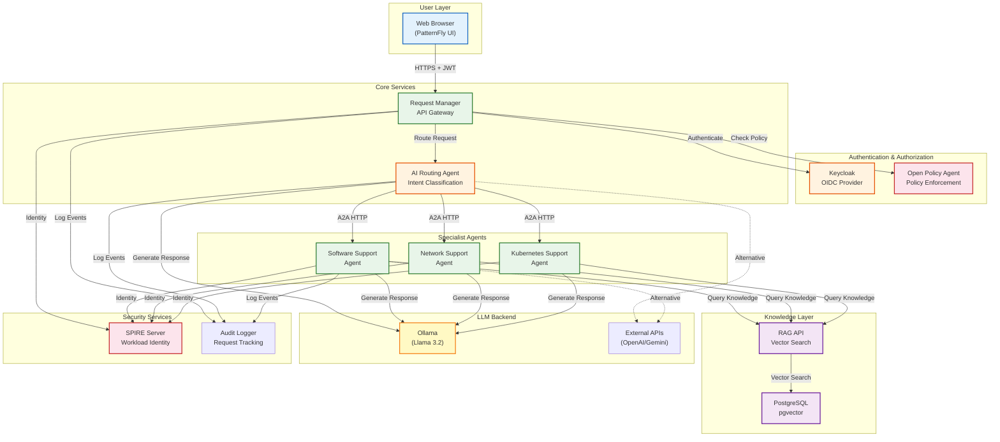

# Architecture Diagram

## Component Description

### User Layer
- **Web Browser**: PatternFly-based React UI for user interaction

### Authentication & Authorization
- **Keycloak**: OpenID Connect provider for user authentication
- **OPA**: Policy-as-code engine enforcing department access rules

### Core Services
- **Request Manager**: API gateway handling all incoming requests
- **Router**: AI agent that classifies user intent and routes to specialists

### Specialist Agents
- **Software Support**: Handles application errors, crashes, and software issues
- **Network Support**: Handles VPN, connectivity, and network problems
- **Kubernetes Support**: Handles pod, deployment, and cluster issues

### Knowledge Layer
- **RAG API**: Vector search over historical support tickets
- **PostgreSQL + pgvector**: Stores embeddings and ticket data

### LLM Backend
- **Ollama (Default)**: Local open-weight model (Llama 3.2)
- **External APIs**: Optional OpenAI, Gemini, or Anthropic

### Security Services
- **SPIRE**: SPIFFE workload identity for service-to-service auth
- **Audit Logger**: Tracks all requests for compliance and debugging
