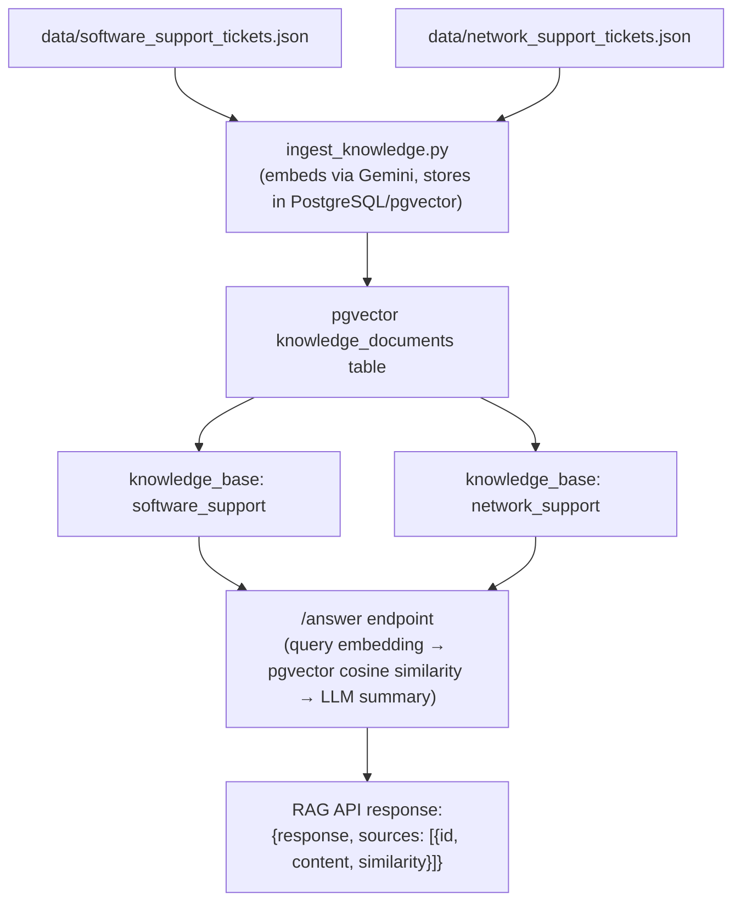

# RAG -- Retrieval-Augmented Generation

Specialist agents don't hallucinate answers -- they query a knowledge base of historical support tickets via RAG and ground their responses in real data.

## Data Flow

## How It Works

1. **Ingestion** (`ingest_knowledge.py`): Reads JSON support tickets, embeds each ticket using the Gemini embeddings model (`models/gemini-embedding-001`), and stores vectors in PostgreSQL with pgvector extension.

2. **Query** (`rag_service.py`): When a specialist agent receives a user message, the agent-service calls `POST /answer` on the RAG API. The RAG API embeds the query, performs cosine similarity search using pgvector, and returns the top matching tickets with similarity scores.

3. **Grounding** (`main.py`): The agent-service builds the LLM prompt by combining the agent's system message, conversation history, and the RAG results as context. The LLM generates a response that references specific ticket IDs and known solutions.

## Components

| Component | Role | Port |
|-----------|------|------|
| PostgreSQL + pgvector | Vector database storing embedded support tickets (3072-dim vectors, no index due to pgvector 2000-dim limit -- see [Production Recommendations](production.md)) | 5432 |
| RAG API | FastAPI service that embeds queries and performs pgvector similarity search | 8003 |
| Gemini Embeddings | `models/gemini-embedding-001` for vector generation (3072 dimensions) | -- |

## Synthetic Data

The system ships with synthetic support tickets in `data/`:
- **software_support_tickets.json** -- Application crashes, error codes, performance issues
- **network_support_tickets.json** -- VPN, DNS, firewall, connectivity problems

Each ticket has an ID, description, resolution, and category.
