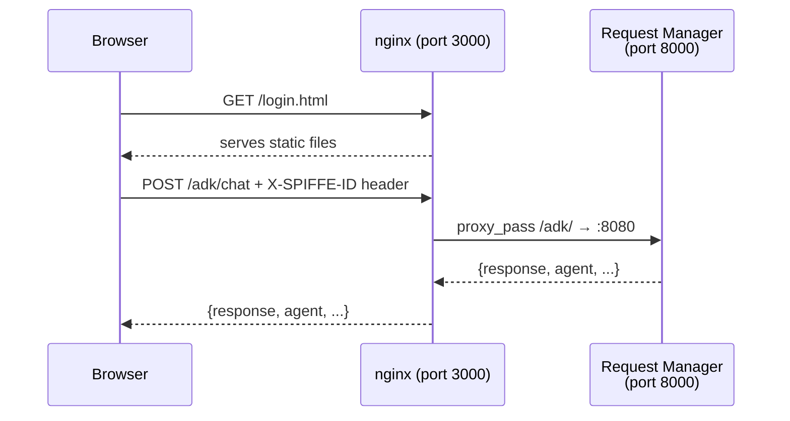

# PatternFly Web UI

The system uses a custom PatternFly-based chat UI for the chat interface. It loads **PatternFly 6** CSS (`@patternfly/patternfly@6`) and the **PatternFly Chatbot** extension (`@patternfly/chatbot@6`) from CDN. The UI is plain HTML/CSS/JS served by nginx -- it does not use React or `@patternfly/react-core`.

## Pages

| Page | File | Purpose |
|------|------|---------|
| Login | `login.html` | Email form with quick-login buttons for test users. Sets user identity for chat session. |
| Chat | `chat.html` | PatternFly 6 chat interface. Sends `POST /adk/chat` with user email. Displays agent responses with markdown. |
| Audit | `audit.html` | Request audit log. Calls `GET /adk/audit` and displays all request logs in a table with agent, timing, and response data. |
| Index | `index.html` | Landing page that redirects to login or chat based on auth state. |

## Architecture

The nginx container serves the static HTML/JS files and reverse-proxies `/adk/` and `/api/` requests to the request-manager. No build step, no Node.js runtime -- just static files served by nginx.
